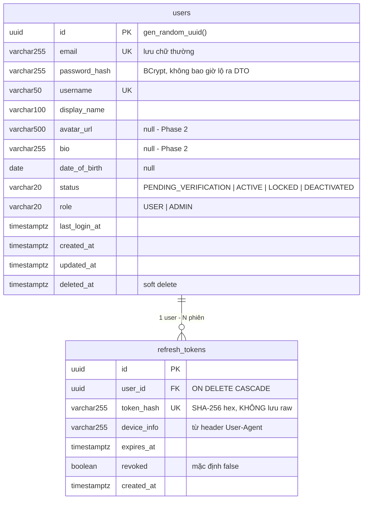
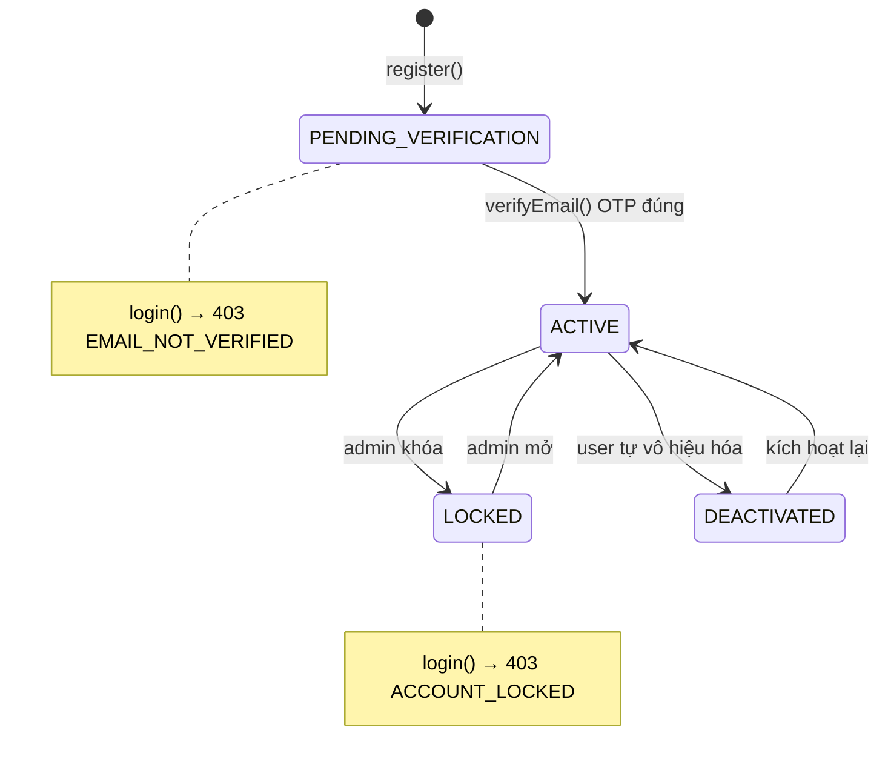
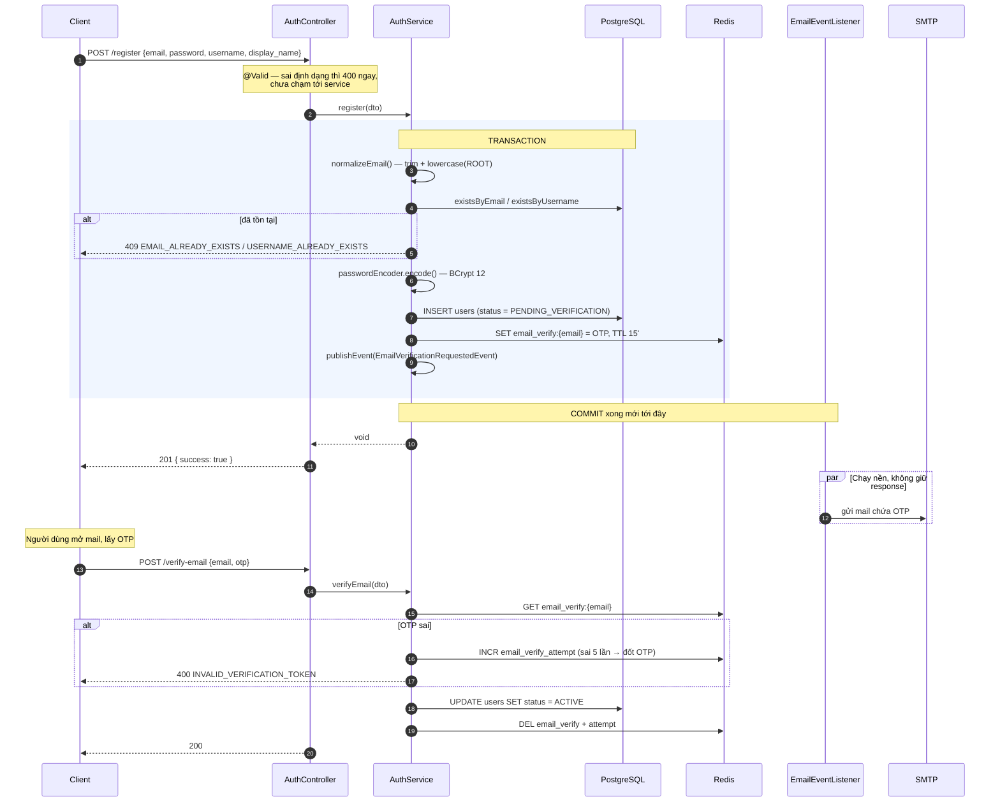
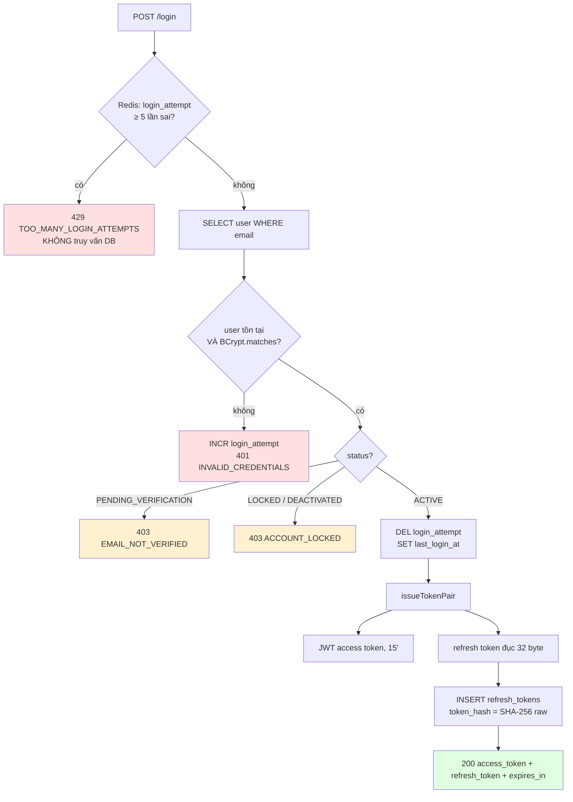
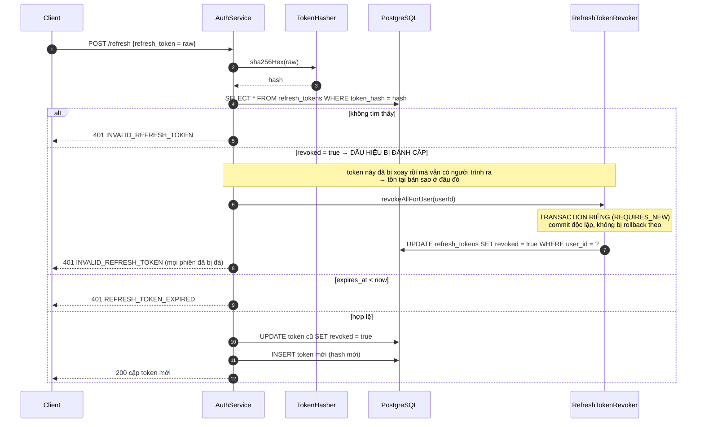
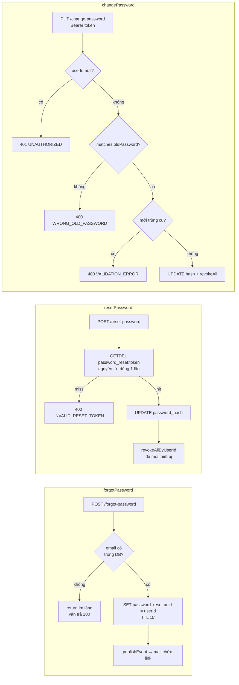

# BÁO CÁO PHASE 1 — AUTH MODULE

**Dự án**: ChatSphere backend · **Stack**: Spring Boot 4.1.1, Java 21, PostgreSQL 16, Redis 7
**Trạng thái**: hoàn thành, 26/26 test xanh
**Tài liệu liên quan**: `01_SYSTEM_DESIGN.md` (§7 data model, §8 API), `03_CODE_ROADMAP.md` (§Phase 1)

---

## MỤC LỤC

1. [Phạm vi đã làm](#1-phạm-vi-đã-làm)
2. [Bản đồ file](#2-bản-đồ-file)
3. [Kiến trúc tầng](#3-kiến-trúc-tầng)
4. [Mô hình dữ liệu](#4-mô-hình-dữ-liệu)
5. [Bảng endpoint](#5-bảng-endpoint)
6. [Luồng nghiệp vụ chi tiết](#6-luồng-nghiệp-vụ-chi-tiết)
7. [Lý thuyết nền](#7-lý-thuyết-nền)
8. [Bản đồ mã lỗi](#8-bản-đồ-mã-lỗi)
9. [Bảo mật](#9-bảo-mật)
10. [Cấu hình](#10-cấu-hình)
11. [Test](#11-test)
12. [Lỗi đã phát hiện và sửa](#12-lỗi-đã-phát-hiện-và-sửa)
13. [Nợ kỹ thuật](#13-nợ-kỹ-thuật)
14. [Chạy thử bằng tay](#14-chạy-thử-bằng-tay)

---

## 1. PHẠM VI ĐÃ LÀM

7 use case UC-01 → UC-07:

| UC | Tên | Endpoint | Trạng thái |
|---|---|---|---|
| UC-01 | Đăng ký tài khoản | `POST /api/v1/auth/register` | ✅ |
| UC-02 | Xác thực email bằng OTP | `POST /api/v1/auth/verify-email` | ✅ |
| UC-03 | Đăng nhập | `POST /api/v1/auth/login` | ✅ |
| UC-04 | Làm mới token | `POST /api/v1/auth/refresh` | ✅ |
| UC-05 | Đăng xuất | `POST /api/v1/auth/logout` | ✅ |
| UC-06 | Quên / đặt lại mật khẩu | `POST /auth/forgot-password`, `POST /auth/reset-password` | ✅ |
| UC-07 | Đổi mật khẩu | `PUT /api/v1/auth/change-password` | ✅ |

**Quy mô**: 27 file Java mới (main) + 2 file test, 2 migration SQL, ~1.400 dòng.

---

## 2. BẢN ĐỒ FILE

```
com.chatsphere
│
├── auth/                                   ← MODULE AUTH
│   ├── controller/
│   │   └── AuthController.java             8 endpoint, mỗi method 2 dòng
│   │
│   ├── dto/                                Toàn bộ là record, chỉ dữ liệu + validation
│   │   ├── StrongPassword.java             @interface gộp @NotBlank+@Size+@Pattern
│   │   ├── RegisterRequest.java            email, password, username, displayName
│   │   ├── VerifyEmailRequest.java         email, otp (6 chữ số)
│   │   ├── LoginRequest.java               email, password
│   │   ├── LoginResponse.java              accessToken, refreshToken, expiresIn
│   │   ├── RefreshTokenRequest.java        refreshToken  (dùng cho cả /refresh và /logout)
│   │   ├── ForgotPasswordRequest.java      email
│   │   ├── ResetPasswordRequest.java       token, newPassword
│   │   └── ChangePasswordRequest.java      oldPassword, newPassword
│   │
│   ├── domain/
│   │   └── RefreshToken.java               entity, KHÔNG kế thừa BaseEntity (không có updated_at)
│   │
│   ├── repository/
│   │   └── RefreshTokenRepository.java     findByTokenHash + bulk revokeAllByUserId
│   │
│   ├── event/                              Tách gửi mail khỏi transaction
│   │   ├── EmailVerificationRequestedEvent.java
│   │   └── PasswordResetRequestedEvent.java
│   │
│   ├── security/
│   │   ├── JwtProperties.java              @ConfigurationProperties("app.jwt"), fail-fast
│   │   ├── JwtTokenProvider.java           sinh/parse JWT + sinh refresh token đục
│   │   ├── TokenHasher.java                SHA-256 hex cho refresh token
│   │   ├── JwtAuthenticationFilter.java    OncePerRequestFilter, đặt principal = UUID
│   │   ├── UserPrincipal.java              record implements UserDetails
│   │   ├── CustomUserDetailsService.java   nạp user theo email
│   │   ├── RestAuthenticationEntryPoint.java   401 dạng JSON
│   │   ├── RestAccessDeniedHandler.java        403 dạng JSON
│   │   └── AuthErrorResponder.java             gom code ghi JSON lỗi ra response
│   │
│   └── service/
│       ├── AuthService.java                TOÀN BỘ luật nghiệp vụ auth
│       ├── AuthTokenStore.java             mọi thứ đụng Redis (OTP, reset token, bộ đếm)
│       └── RefreshTokenRevoker.java        thu hồi phiên ở transaction RIÊNG (REQUIRES_NEW)
│
├── user/
│   ├── domain/{User, UserRole, UserStatus}.java
│   └── repository/UserRepository.java
│
├── email/
│   ├── EmailService.java                   interface
│   ├── SmtpEmailService.java               impl bằng JavaMailSender, text thuần
│   └── EmailEventListener.java             @TransactionalEventListener(AFTER_COMMIT) + @Async
│
├── config/
│   ├── SecurityConfig.java                 SecurityFilterChain
│   ├── PasswordEncoderConfig.java          BCrypt strength 12
│   ├── AsyncConfig.java                    thread pool "mailExecutor"
│   ├── CorsConfig.java / CorsProperties.java
│   └── JpaAuditingConfig.java
│
└── common/                                 (Phase 0, dùng lại)
    ├── BaseEntity.java · ApiResponse.java · ApiError.java
    ├── ErrorCode.java · BusinessException.java · GlobalExceptionHandler.java
```

**Nguyên tắc đặt file**: chia theo **module nghiệp vụ** (`auth`, `user`, `email`) rồi mới chia theo tầng
(`controller`, `service`, `repository`) — không chia theo tầng ở cấp cao nhất. Lý do: khi làm Phase 2
(`friend`) hay Phase 4 (`chat`), toàn bộ code của một tính năng nằm gọn trong một thư mục, không phải
mở 5 thư mục khác nhau.

---

## 3. KIẾN TRÚC TẦNG

```mermaid
flowchart TB
    C[Client<br/>React / Postman]

    subgraph FILTER["Chuỗi Servlet Filter (Spring Security)"]
        direction LR
        F1[CorsFilter] --> F2[JwtAuthenticationFilter<br/>đọc Bearer token<br/>→ SecurityContext]
        F2 --> F3[AuthorizationFilter<br/>áp rule permitAll/authenticated]
        F3 --> F4[ExceptionTranslationFilter<br/>→ 401 / 403 JSON]
    end

    subgraph WEB["Tầng Web"]
        AC[AuthController<br/>@Valid, bọc ApiResponse]
        GEH[GlobalExceptionHandler<br/>@RestControllerAdvice]
    end

    subgraph BIZ["Tầng nghiệp vụ"]
        AS[AuthService<br/>@Transactional]
        ATS[AuthTokenStore]
        RTR[RefreshTokenRevoker<br/>REQUIRES_NEW]
        JTP[JwtTokenProvider]
        TH[TokenHasher]
        PE[PasswordEncoder<br/>BCrypt 12]
    end

    subgraph DATA["Tầng dữ liệu"]
        UR[(UserRepository)]
        RTREPO[(RefreshTokenRepository)]
        PG[(PostgreSQL)]
        RD[(Redis)]
    end

    subgraph ASYNC["Nền — sau khi commit"]
        EL[EmailEventListener<br/>@Async mailExecutor]
        SES[SmtpEmailService]
        SMTP[(MailHog / SMTP)]
    end

    C -->|HTTP| F1
    F4 --> AC
    AC --> AS
    AC -.exception.-> GEH
    AS --> ATS & RTR & JTP & TH & PE
    AS --> UR & RTREPO
    UR & RTREPO --> PG
    ATS --> RD
    AS -.publishEvent.-> EL
    EL --> SES --> SMTP
```

**Đọc sơ đồ theo một request**: request chạy qua chuỗi filter trước, `JwtAuthenticationFilter`
dịch `Authorization: Bearer ...` thành danh tính trong `SecurityContext`; `AuthorizationFilter`
quyết định cho qua hay chặn; đến được controller thì controller chỉ chuyển tiếp xuống service.
Mọi exception ném ra từ service bay ngược lên `GlobalExceptionHandler`. Việc gửi mail **không**
nằm trong đường đi của response — nó tách ra nhánh nền sau khi transaction commit.

---

## 4. MÔ HÌNH DỮ LIỆU



### State machine của `users.status`



Chỉ trạng thái `ACTIVE` mới đăng nhập được. Kiểm tra trạng thái nằm **sau** kiểm tra mật khẩu
(mục 9 giải thích tại sao).

### Dữ liệu tạm trong Redis

| Key | Giá trị | TTL | Sinh ra ở | Xóa ở |
|---|---|---|---|---|
| `email_verify:{email}` | OTP 6 chữ số | 15 phút | `register()` | `verifyEmail()` thành công, hoặc sai 5 lần |
| `email_verify_attempt:{email}` | số lần nhập sai | 15 phút | lần nhập sai đầu | cấp OTP mới / xác thực xong |
| `password_reset:{uuid}` | `userId` | 15 phút | `forgotPassword()` | `resetPassword()` (đọc-và-xóa nguyên tử) |
| `login_attempt:{email}` | số lần sai | 15 phút | lần sai đầu | đăng nhập thành công |

**Vì sao Redis chứ không phải Postgres**: cả 4 loại đều có TTL tự nhiên và mất đi cũng không sao.
Để ở Postgres thì phải tự viết job dọn rác, thêm bảng, thêm index — trong khi Redis xóa hộ miễn phí.

---

## 5. BẢNG ENDPOINT

Mọi response đều bọc trong phong bì `ApiResponse` (§8.1 thiết kế), JSON dùng **snake_case**.

| # | Method | Path | Auth | Body vào | Body ra (`data`) | Thành công |
|---|---|---|---|---|---|---|
| 1 | POST | `/api/v1/auth/register` | — | email, password, username, display_name | `null` | 201 |
| 2 | POST | `/api/v1/auth/verify-email` | — | email, otp | `null` | 200 |
| 3 | POST | `/api/v1/auth/login` | — | email, password | access_token, refresh_token, expires_in | 200 |
| 4 | POST | `/api/v1/auth/refresh` | — | refresh_token | access_token, refresh_token, expires_in | 200 |
| 5 | POST | `/api/v1/auth/logout` | — | refresh_token | `null` | 200 |
| 6 | POST | `/api/v1/auth/forgot-password` | — | email | `null` | 200 (luôn luôn) |
| 7 | POST | `/api/v1/auth/reset-password` | — | token, new_password | `null` | 200 |
| 8 | PUT | `/api/v1/auth/change-password` | **Bearer** | old_password, new_password | `null` | 200 |

### Phong bì response

```jsonc
// Thành công
{
  "success": true,
  "data": { "access_token": "eyJ...", "refresh_token": "K3xQ...", "expires_in": 900 },
  "error": null,
  "timestamp": "2026-09-05T00:39:15.148Z"
}

// Thất bại
{
  "success": false,
  "data": null,
  "error": { "code": "INVALID_CREDENTIALS", "message": "Email hoặc mật khẩu không đúng" },
  "timestamp": "2026-09-05T00:39:15.148Z"
}
```

`error.code` là `ErrorCode.name()` — chuỗi ổn định để frontend bắt bằng `switch`. `error.message`
là tiếng Việt để hiển thị thẳng cho người dùng.

---

## 6. LUỒNG NGHIỆP VỤ CHI TIẾT

### 6.1. Đăng ký + xác thực email (UC-01, UC-02)



**Điểm cần nắm**: `publishEvent` được gọi *bên trong* transaction nhưng listener chỉ chạy *sau khi
commit*. Nếu `INSERT users` rollback vì lý do gì đó, mail không bao giờ được gửi — không còn cảnh
người dùng nhận OTP cho một tài khoản không tồn tại.

---

### 6.2. Đăng nhập (UC-03)



Ba chỗ có chủ ý:

1. **Chốt brute-force đứng trước truy vấn DB** — bị khóa thì không được phép ép DB làm việc.
2. **"Email không tồn tại" và "sai mật khẩu" trả cùng một lỗi** `INVALID_CREDENTIALS`. Trả
   `USER_NOT_FOUND` cho trường hợp đầu sẽ biến endpoint login thành công cụ dò email nào có trong
   hệ thống.
3. **Xét trạng thái sau khi mật khẩu đã đúng** — tới bước này người gọi đã chứng minh mình là chủ
   tài khoản, tiết lộ "chưa xác thực email" là an toàn và hữu ích.

---

### 6.3. Refresh + rotation + phát hiện token bị đánh cắp (UC-04)



**Vì sao rotation**: không xoay thì một refresh token bị lộ dùng được suốt 7 ngày và không để lại
dấu vết. Có xoay thì kẻ trộm và người dùng thật tranh nhau cùng một token — ai dùng sau sẽ trình ra
một token đã `revoked`, và đó chính là tín hiệu để hệ thống đá toàn bộ phiên (OAuth 2.0 Security BCP
§4.14.2).

**Vì sao cần `RefreshTokenRevoker` riêng**: việc thu hồi và việc ném lỗi nằm trong cùng một lời gọi.
Nếu cả hai ở chung transaction, exception làm rollback luôn lệnh thu hồi — kẻ tấn công nhận 401 nhưng
các token vẫn sống nguyên. `REQUIRES_NEW` tách lệnh thu hồi sang transaction riêng, commit trước khi
exception được ném. Nó **phải** là một bean khác vì `@Transactional` hoạt động qua proxy: gọi method
của chính mình sẽ bỏ qua proxy và propagation mất tác dụng.

---

### 6.4. Quên / đặt lại / đổi mật khẩu (UC-06, UC-07)



**`forgotPassword` luôn trả 200** kể cả khi email không tồn tại. Đây là đánh đổi có ý thức: mất một
chút thân thiện (người dùng gõ nhầm email không được báo) để endpoint công khai này không trở thành
máy dò tài khoản.

**`GETDEL` nguyên tử**: nếu tách thành `GET` rồi `DEL`, hai request song song cùng đọc được token và
cả hai cùng đổi được mật khẩu.

---

## 7. LÝ THUYẾT NỀN

### 7.1. Vì sao access token là JWT còn refresh token thì không

| | Access token | Refresh token |
|---|---|---|
| **Dạng** | JWT ký HMAC-SHA256 | 32 byte `SecureRandom`, base64url |
| **Tuổi thọ** | 15 phút | 7 ngày |
| **Lưu ở server?** | Không | Có — bảng `refresh_tokens`, dạng **hash** |
| **Xác thực bằng** | Kiểm tra chữ ký, không cần DB | Tra DB theo `token_hash` |
| **Thu hồi được?** | Không (phải chờ hết hạn) | Có, ngay lập tức |
| **Tần suất dùng** | Mỗi request | 15 phút/lần |

JWT tự chứa thông tin và tự xác thực — mỗi request API không cần một vòng đi DB. Cái giá là **không
thu hồi được**: đã ký ra rồi thì nó hợp lệ tới lúc hết hạn. Vì thế đặt tuổi thọ ngắn (15 phút) để
cửa sổ thiệt hại nhỏ.

Refresh token thì ngược lại: cần thu hồi được (logout, đổi mật khẩu, phát hiện đánh cắp) nên **bắt
buộc** phải có trạng thái ở server. Đã phải tra DB thì không có lý do gì làm nó thành JWT — một chuỗi
ngẫu nhiên đủ dài vừa đơn giản vừa ngắn hơn.

### 7.2. Vì sao BCrypt cho mật khẩu nhưng SHA-256 cho refresh token

| | Mật khẩu | Refresh token |
|---|---|---|
| **Nguồn gốc** | Người đặt → entropy thấp, đoán được | `SecureRandom` 256 bit → không đoán nổi |
| **Hàm băm** | BCrypt strength 12 (~100 ms) | SHA-256 (~micro giây) |
| **Có salt?** | Có, ngẫu nhiên mỗi lần | Không |
| **Tra cứu** | Luôn biết trước user nào → so 1 lần | `WHERE token_hash = ?` → cần tất định |

BCrypt cố tình chậm để chống dò offline. Nhưng salt ngẫu nhiên khiến cùng một input cho ra hash khác
nhau mỗi lần — không thể dùng trong mệnh đề `WHERE`, sẽ phải load toàn bộ bảng ra so từng dòng. Với
refresh token, đầu vào đã ngẫu nhiên 256 bit nên không sợ rainbow table; chỉ cần hash một chiều để
DB rò rỉ cũng không dùng được, và **tất định** để chạm được index.

### 7.3. Thứ tự chuỗi filter và vì sao nó quan trọng

```
Request
  │
  ├─▶ CorsFilter                    ← xử lý preflight OPTIONS
  ├─▶ JwtAuthenticationFilter       ← ta chèn TẠI ĐÂY (addFilterBefore)
  │     đọc "Authorization: Bearer ..."
  │     parse + verify chữ ký
  │     SecurityContextHolder.setAuthentication(userId, ROLE_xxx)
  │     ↳ token hỏng/hết hạn → KHÔNG ném lỗi, chỉ bỏ qua (log debug)
  │
  ├─▶ UsernamePasswordAuthenticationFilter   ← không dùng (form login)
  ├─▶ AuthorizationFilter
  │     duyệt rule TỪ TRÊN XUỐNG, matcher đầu tiên khớp thắng:
  │       1. PUT /api/v1/auth/change-password  → authenticated()
  │       2. /api/v1/auth/**                   → permitAll()
  │       3. anyRequest()                      → authenticated()
  │     không có Authentication → ném AccessDeniedException
  │
  ├─▶ ExceptionTranslationFilter
  │     chưa đăng nhập  → RestAuthenticationEntryPoint → 401 JSON
  │     đã đăng nhập nhưng thiếu quyền → RestAccessDeniedHandler → 403 JSON
  │
  └─▶ DispatcherServlet → AuthController
```

**`JwtAuthenticationFilter` cố tình không ném lỗi khi token hỏng.** Nó chỉ *cố gắng* xác thực. Việc
quyết định "endpoint này có cần đăng nhập không" là của `AuthorizationFilter`. Nếu filter JWT ném 401
ngay khi thấy token xấu, thì gọi `/auth/login` kèm một token cũ đã hết hạn sẽ bị chặn — dù login vốn
là endpoint công khai.

**Thứ tự rule là chuyện sống còn.** Nếu `permitAll("/api/v1/auth/**")` đứng trước, nó sẽ khớp luôn
`/auth/change-password` và endpoint đổi mật khẩu mở toang cho bất kỳ ai. Rule hẹp phải đứng trước
rule rộng.

### 7.4. Transaction, dirty checking, và bẫy bulk update

Trong một method `@Transactional`, entity load từ repository ở trạng thái **managed**. Hibernate giữ
một snapshot lúc load, và khi commit sẽ so sánh để tự phát `UPDATE`. Vì thế:

```java
User user = userRepository.findById(id).orElseThrow(...);
user.setStatus(UserStatus.ACTIVE);   // KHÔNG cần gọi save()
```

`register()` thì ngược lại, **phải** `save()` — `new User()` là đối tượng transient, Hibernate chưa
biết nó tồn tại.

**Cái bẫy**: bulk update JPQL (`@Modifying`) đi thẳng xuống DB, không qua persistence context.

```java
user.setPasswordHash(newHash);                    // mới chỉ dirty trong bộ nhớ
refreshTokenRepository.revokeAllByUserId(userId); // JPQL UPDATE trên bảng KHÁC
```

Hibernate chỉ auto-flush trước một query khi query đó chạm vào bảng của entity đang dirty. Ở đây câu
JPQL chạm `refresh_tokens` còn entity dirty là `User` → **không flush**. Mà `clearAutomatically = true`
lại xóa sạch persistence context → thay đổi mật khẩu bị vứt đi, **không có lỗi nào được ném**.

Cách sửa là `flushAutomatically = true` để ép flush trước rồi mới clear:

```java
@Modifying(clearAutomatically = true, flushAutomatically = true)
@Query("UPDATE RefreshToken r SET r.revoked = true WHERE r.user.id = :userId AND r.revoked = false")
int revokeAllByUserId(@Param("userId") UUID userId);
```

### 7.5. Event sau commit + chạy nền

Hai annotation giải quyết hai vấn đề khác nhau, cần cả hai:

| Annotation | Giải quyết | Không có nó thì sao |
|---|---|---|
| `@TransactionalEventListener(AFTER_COMMIT)` | **Đúng đắn** | Transaction rollback nhưng mail đã gửi → user nhận OTP cho tài khoản không tồn tại |
| `@Async("mailExecutor")` | **Độ trễ** | Người dùng bấm "Đăng ký" rồi ngồi chờ SMTP bắt tay xong mới thấy phản hồi |

Có thể làm ngắn hơn bằng cách đánh thẳng `@Async` lên `SmtpEmailService` và bỏ event đi. Nhưng như
vậy: (1) mất mốc `AFTER_COMMIT`; (2) `@Async` là proxy AOP — nếu `AuthService` gọi method `@Async`
của chính nó thì proxy bị bỏ qua và code chạy đồng bộ mà không báo gì. Tách qua event tránh cả hai.

**Cái giá**: SMTP chết thì mail mất luôn, không retry, app restart là bay hàng đợi. Với email OTP thì
chấp nhận được (bù bằng chức năng gửi lại mã). Muốn đảm bảo thật sự cần **transactional outbox** —
ghi bản ghi vào bảng `outbox_email` trong cùng transaction, một scheduler đọc và gửi có retry. Đó là
kiến trúc đúng cho hệ thống thanh toán, thừa cho việc này.

---

## 8. BẢN ĐỒ MÃ LỖI

`ErrorCode.name()` là chuỗi frontend bắt; `HttpStatus` do enum quyết định, `GlobalExceptionHandler`
chỉ đọc lại.

| Mã | HTTP | Ném ở đâu |
|---|---|---|
| `VALIDATION_ERROR` | 400 | `@Valid` thất bại; mật khẩu mới trùng mật khẩu cũ |
| `EMAIL_ALREADY_EXISTS` | 409 | `register()` |
| `USERNAME_ALREADY_EXISTS` | 409 | `register()` |
| `INVALID_VERIFICATION_TOKEN` | 400 | `verifyEmail()` — OTP sai hoặc hết hạn |
| `INVALID_CREDENTIALS` | 401 | `login()` — email không tồn tại **hoặc** sai mật khẩu |
| `EMAIL_NOT_VERIFIED` | 403 | `login()` — `status = PENDING_VERIFICATION` |
| `ACCOUNT_LOCKED` | 403 | `login()` — `status = LOCKED / DEACTIVATED` |
| `TOO_MANY_LOGIN_ATTEMPTS` | 429 | `login()` — Redis đếm ≥ 5 |
| `INVALID_REFRESH_TOKEN` | 401 | `refresh()` — không tồn tại hoặc đã thu hồi |
| `REFRESH_TOKEN_EXPIRED` | 401 | `refresh()` — quá `expires_at` |
| `INVALID_RESET_TOKEN` | 400 | `resetPassword()` |
| `WRONG_OLD_PASSWORD` | 400 | `changePassword()` |
| `USER_NOT_FOUND` | 404 | `verifyEmail()` / `resetPassword()` — dữ liệu không nhất quán |
| `UNAUTHORIZED` | 401 | filter chain; `changePassword()` khi principal null |
| `ACCESS_DENIED` | 403 | filter chain / `@PreAuthorize` |
| `INTERNAL_ERROR` | 500 | lưới cuối — log đầy đủ, client không thấy chi tiết |

---

## 9. BẢO MẬT

| Nguy cơ | Biện pháp | Ở đâu |
|---|---|---|
| Lộ CSDL → lộ mật khẩu | BCrypt strength 12, có salt | `PasswordEncoderConfig` |
| Lộ CSDL → lộ refresh token | Chỉ lưu SHA-256 hex, raw không bao giờ chạm DB | `TokenHasher`, `AuthService.issueTokenPair` |
| Dò email tồn tại (user enumeration) | Login trả cùng một lỗi cho cả 2 trường hợp; forgot-password luôn 200 | `AuthService.login/forgotPassword` |
| Brute-force mật khẩu | Redis `INCR` theo email, khóa 15' khi ≥ 5 lần; chặn **trước** truy vấn DB | `AuthTokenStore.isLoginLocked` |
| Brute-force OTP (1 triệu tổ hợp trong 15') | Đếm số lần sai, sai 5 lần thì **đốt luôn OTP** | `AuthTokenStore.matchesEmailOtp` |
| Rò rỉ qua thời gian phản hồi | So OTP bằng `MessageDigest.isEqual` (hằng thời gian) | `AuthTokenStore.matchesEmailOtp` |
| Refresh token bị đánh cắp | Rotation mỗi lần dùng + phát hiện dùng lại → thu hồi toàn bộ phiên | `AuthService.refresh`, `RefreshTokenRevoker` |
| Token reset dùng nhiều lần | `GETDEL` nguyên tử → dùng đúng 1 lần | `AuthTokenStore.consumeResetToken` |
| Đổi mật khẩu người khác | `userId` lấy từ `SecurityContext` (đã verify chữ ký JWT), **không** từ request body | `AuthController.changePassword` |
| Đổi mật khẩu xong phiên cũ vẫn sống | `revokeAllByUserId` sau mỗi lần đổi/đặt lại mật khẩu | `AuthService` |
| Secret JWT yếu | `Keys.hmacShaKeyFor` ném `WeakKeyException` nếu < 256 bit; `JwtProperties` ném nếu secret rỗng | `JwtTokenProvider`, `JwtProperties` |
| CSRF | Không dùng cookie/session, token ở header → tắt CSRF là đúng, không phải bỏ qua | `SecurityConfig` |
| Session fixation | `SessionCreationPolicy.STATELESS` | `SecurityConfig` |
| Email tự động thành 2 tài khoản khác nhau | Chuẩn hóa `trim().toLowerCase(Locale.ROOT)` | `AuthService.normalizeEmail` |
| Lộ stack trace | `GlobalExceptionHandler` bắt `Exception` → 500 với message chung | `GlobalExceptionHandler` |

---

## 10. CẤU HÌNH

| Key | dev | test | Ý nghĩa |
|---|---|---|---|
| `app.jwt.secret` | biến môi trường `JWT_SECRET` | cố định trong yaml | Khóa HMAC, base64, ≥ 32 byte |
| `app.jwt.access-expiration-ms` | 900000 (15') | 900000 | Tuổi thọ access token |
| `app.jwt.refresh-expiration-ms` | 604800000 (7 ngày) | 604800000 | Tuổi thọ refresh token |
| `app.mail.from` | `no-reply@chatsphere.local` | `no-reply@chatsphere.test` | Địa chỉ người gửi |
| `app.frontend-url` | `http://localhost:5173` | như dev | Dựng link reset mật khẩu |
| `app.cors.allowed-origins` | `http://localhost:5173` | như dev | CORS |
| `spring.mail.host/port` | `localhost:1025` (MailHog) | `localhost:1025`, bị mock | SMTP |
| `spring.data.redis.*` | `localhost:6379`, có password | Testcontainers, **password rỗng** | Redis |
| `spring.jpa.hibernate.ddl-auto` | `validate` | `validate` | Flyway sở hữu schema, JPA chỉ đối chiếu |

> ⚠️ `application-dev.yaml` có giá trị mặc định cho `JWT_SECRET` để chạy local không cần setup gì.
> **Production bắt buộc phải set biến môi trường thật** — giá trị trong file đã nằm trong git.

---

## 11. TEST

**26 test, tất cả xanh.** Thời gian chạy toàn bộ suite ~1 phút 17 giây (phần lớn là khởi động container).

### Chiến lược hai tầng

| | Unit test | Integration test |
|---|---|---|
| **File** | `AuthServiceTest` | `AuthFlowIntegrationTest` |
| **Số test** | 18 | 3 |
| **Dựng gì** | Không gì cả — Mockito thuần | Spring context + Postgres + Redis (Testcontainers) |
| **Tốc độ** | 1,1 s cho cả 18 | 20,8 s cho 3 |
| **Trả lời câu hỏi** | "Luật nghiệp vụ có đúng không?" | "Các mảnh có ráp được với nhau không?" |

Tỉ lệ này là chủ ý: integration test đắt nên chỉ viết cho luồng chính; nhánh lỗi phủ bằng unit test
rẻ và chạy tức thì. Làm ngược lại thì suite chạy hàng phút và mỗi lần đỏ phải đoán lỗi nằm ở tầng nào.

### Integration test — 3 kịch bản

| Test | Kiểm chứng |
|---|---|
| `dangKy_xacThuc_dangNhap_goiApiBaoVe` | Trọn vẹn luồng nghiệm thu Phase 1, **cộng** 2 assertion phủ định: chưa xác thực → 403; không token → 401. Kết thúc bằng việc chứng minh đổi mật khẩu đã thu hồi refresh token cũ. |
| `refreshToken_xoayVong_tokenCuKhongDungLaiDuoc` | Rotation hoạt động; token cũ bị từ chối; và vì đó là dấu hiệu đánh cắp, token **mới** cũng bị thu hồi theo. |
| `register_dtoKhongHopLe_tra400VaChiRoField` | `@Valid` thực sự chạy, trả `VALIDATION_ERROR`. |

**Lấy OTP không qua mail**: test dùng `@RecordApplicationEvents` để bắt
`EmailVerificationRequestedEvent` ngay lúc `publishEvent` (đồng bộ, trong transaction). Ba lựa chọn
đã cân nhắc:

- Đọc mail thật từ MailHog qua HTTP API → phụ thuộc dịch vụ ngoài, chậm, hay chớp tắt.
- Mock `EmailService` + `ArgumentCaptor` → listener chạy `@Async`, phải `Awaitility.await()` chờ.
- `@RecordApplicationEvents` → có mặt tức thì, không chờ, không flaky. ✅

`JavaMailSender` được `@MockitoBean` để chặn mọi kết nối SMTP. Mock ở tầng **thấp nhất** giữ nguyên
`SmtpEmailService` và `EmailEventListener` trong phạm vi test.

### Unit test — 18 nhánh

Đăng ký (3): email trùng · username trùng · chuẩn hóa email + trạng thái khởi tạo
Xác thực (2): OTP sai không xóa OTP · OTP đúng chuyển ACTIVE
Đăng nhập (6): đã khóa (và không chạm DB) · email lạ · sai mật khẩu · chưa xác thực · bị khóa · thành công
Refresh (4): không tồn tại · đã thu hồi (kiểm tra gọi revoker) · hết hạn · hợp lệ có rotation
Đăng xuất (1): idempotent
Mật khẩu (4): forgot email lạ im lặng · principal null · sai mật khẩu cũ · mới trùng cũ · thành công

Nhiều test dùng `verify(..., never())` — ví dụ `login_daKhoaViSaiQuaNhieu` khẳng định
`userRepository` **không** được gọi, chứng minh chốt brute-force nằm trước truy vấn DB. Assertion
"ném đúng lỗi" một mình không bắt được chuyện đó.

---

## 12. LỖI ĐÃ PHÁT HIỆN VÀ SỬA

Rà soát toàn bộ code Phase 1 phát hiện 7 vấn đề. Xếp theo mức nghiêm trọng:

### 🔴 1. Mất dữ liệu âm thầm — đổi mật khẩu không có hiệu lực

`RefreshTokenRepository.revokeAllByUserId` khai báo `@Modifying(clearAutomatically = true)` nhưng
thiếu `flushAutomatically = true`. Caller (`changePassword`, `resetPassword`) vừa
`setPasswordHash(...)` xong thì gọi hàm này; Hibernate không auto-flush (khác bảng), `clearAutomatically`
xóa sạch context → **mật khẩu mới bị vứt đi, không có exception nào**. Người dùng thấy 200 OK nhưng
mật khẩu không đổi.

→ Thêm `flushAutomatically = true`. Chi tiết cơ chế ở §7.4.

### 🔴 2. Thu hồi phiên bị rollback ngay sau khi thực hiện

Code phát hiện token bị đánh cắp gọi `revokeAllByUserId(...)` rồi ném `BusinessException` — trong
cùng transaction. Exception làm rollback luôn lệnh thu hồi: kẻ tấn công nhận 401 nhưng **mọi token
vẫn sống**. Biện pháp bảo mật trở thành vô nghĩa.

→ Tách sang `RefreshTokenRevoker` với `@Transactional(REQUIRES_NEW)`. Bug này do integration test
`refreshToken_xoayVong_...` bắt được (kỳ vọng 401, nhận 200) — chính là lý do viết assertion đó.

### 🟠 3. OTP có thể bị quét cạn

`verifyEmail` không giới hạn số lần thử. OTP 6 chữ số = 1.000.000 tổ hợp, TTL 15 phút — thừa sức
quét hết bằng script.

→ Thêm bộ đếm `email_verify_attempt:{email}`, sai 5 lần thì **hủy luôn mã**, buộc gửi lại.

### 🟠 4. Endpoint đổi mật khẩu mở công khai

`PUBLIC_ENDPOINTS` chứa `/api/v1/auth/**`, khớp luôn `/auth/change-password`. Gọi không kèm token
vẫn qua được filter chain; `@AuthenticationPrincipal` nhận `null` → `NullPointerException` → 500.

→ Chèn `.requestMatchers(PUT, "/api/v1/auth/change-password").authenticated()` **trước** rule
`permitAll`, cộng thêm guard `userId == null → 401` trong service làm lớp phòng thủ thứ hai.
Integration test bước 6 khóa hành vi này lại.

### 🟡 5. So sánh OTP rò rỉ qua thời gian phản hồi

`String.equals` thoát sớm ở ký tự khác đầu tiên → thời gian phản hồi tiết lộ độ dài tiền tố đúng.

→ Dùng `MessageDigest.isEqual` (hằng thời gian).

### 🟡 6. `toLowerCase()` không có locale

Ở locale Thổ Nhĩ Kỳ, `"I".toLowerCase()` cho ra `"ı"` (không chấm). Cùng một email chuẩn hóa khác
nhau tùy locale mặc định của JVM đang chạy.

→ `toLowerCase(Locale.ROOT)`.

### 🟡 7. `Integer.parseInt` không bọc lỗi

Giá trị rác trong Redis (key trùng, ai đó ghi tay) làm `isLoginLocked` ném `NumberFormatException`
→ 500, chặn đăng nhập của cả tài khoản đó.

→ Bọc try-catch, xóa key rác và cho qua.

### Ngoài ra

- Xóa comment `// File dự kiến: ...` còn sót ở `EmailEventListener`.
- Bổ sung `app.jwt.*`, `spring.mail.host`, `spring.data.redis.password` (rỗng) vào
  `application-test.yaml` — thiếu chúng thì context test không khởi động được.
- Thêm Redis container vào `TestcontainersConfiguration`, bật lại `management.health.redis`.

---

## 13. NỢ KỸ THUẬT

Ghi lại để không quên, không chặn Phase 2:

| # | Việc | Mức độ | Ghi chú |
|---|---|---|---|
| 1 | **Không có endpoint gửi lại OTP** | Cao | Mail thất lạc là người dùng kẹt hoàn toàn. Nên làm đầu Phase 2. |
| 2 | Mail mất khi SMTP chết | Trung bình | Không retry, không hàng đợi bền vững. Xem §7.5 về outbox pattern. |
| 3 | `forgot-password` không giới hạn tần suất | Trung bình | Có thể bị lạm dụng làm công cụ spam mail người khác. |
| 4 | `username` phân biệt hoa thường | Thấp | `Admin` và `admin` là 2 tài khoản khác nhau — rủi ro giả mạo. |
| 5 | Không có job dọn `refresh_tokens` hết hạn | Thấp | Bảng phình dần. Thêm `@Scheduled` xóa `expires_at < now()`. |
| 6 | `resetPassword` không xét `status` | Thấp | Tài khoản `LOCKED` vẫn đặt lại được mật khẩu (nhưng vẫn không đăng nhập được). |
| 7 | `AuthenticationManager` bean không ai dùng | Thấp | `login()` tự kiểm mật khẩu. Giữ cho Phase sau hoặc xóa. |
| 8 | Mail là text thuần | Thấp | Thêm Thymeleaf khi cần mail có thương hiệu. |
| 9 | Chưa có rate limit toàn cục | Thấp | Mới chỉ chặn brute-force theo email. Phase 8. |

---

## 14. CHẠY THỬ BẰNG TAY

```bash
# 0. Bật hạ tầng
cd infra && docker compose up -d          # Postgres 5433, Redis 6379, MailHog 1025/8025
cd .. && ./mvnw spring-boot:run

# 1. Đăng ký
curl -X POST http://localhost:8080/api/v1/auth/register \
  -H "Content-Type: application/json" \
  -d '{"email":"test@example.com","password":"Password1","username":"tester","display_name":"Tester"}'
# → 201

# 2. Lấy OTP: mở http://localhost:8025 (MailHog), đọc mail

# 3. Xác thực
curl -X POST http://localhost:8080/api/v1/auth/verify-email \
  -H "Content-Type: application/json" \
  -d '{"email":"test@example.com","otp":"123456"}'

# 4. Đăng nhập
curl -X POST http://localhost:8080/api/v1/auth/login \
  -H "Content-Type: application/json" \
  -d '{"email":"test@example.com","password":"Password1"}'
# → { "data": { "access_token": "eyJ...", "refresh_token": "...", "expires_in": 900 } }

# 5. Gọi API bảo vệ
curl -X PUT http://localhost:8080/api/v1/auth/change-password \
  -H "Authorization: Bearer <access_token>" \
  -H "Content-Type: application/json" \
  -d '{"old_password":"Password1","new_password":"NewPassword9"}'
# → 200. Bỏ header Authorization đi thì phải nhận 401.
```

Hoặc dùng Swagger UI: <http://localhost:8080/swagger-ui.html>

### Chạy test

```bash
./mvnw test          # cần Docker Desktop đang chạy (Testcontainers)
```

---

## KẾT LUẬN

Phase 1 hoàn thành đầy đủ 7 use case với 26 test xanh. Quá trình rà soát cuối tìm ra 2 lỗi nghiêm
trọng mà việc chạy tay không phát hiện được — cả hai đều **thất bại âm thầm**: một cái làm mất thay
đổi mật khẩu, một cái vô hiệu hóa biện pháp chống đánh cắp token. Đây là lập luận thực tế nhất cho
việc viết test có assertion phủ định (`verify(never())`, kỳ vọng 401) thay vì chỉ test happy path.

**Sẵn sàng cho Phase 2 — User & Friend Module** (UC-08 → UC-13).
