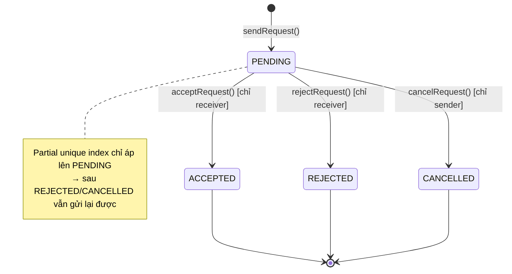
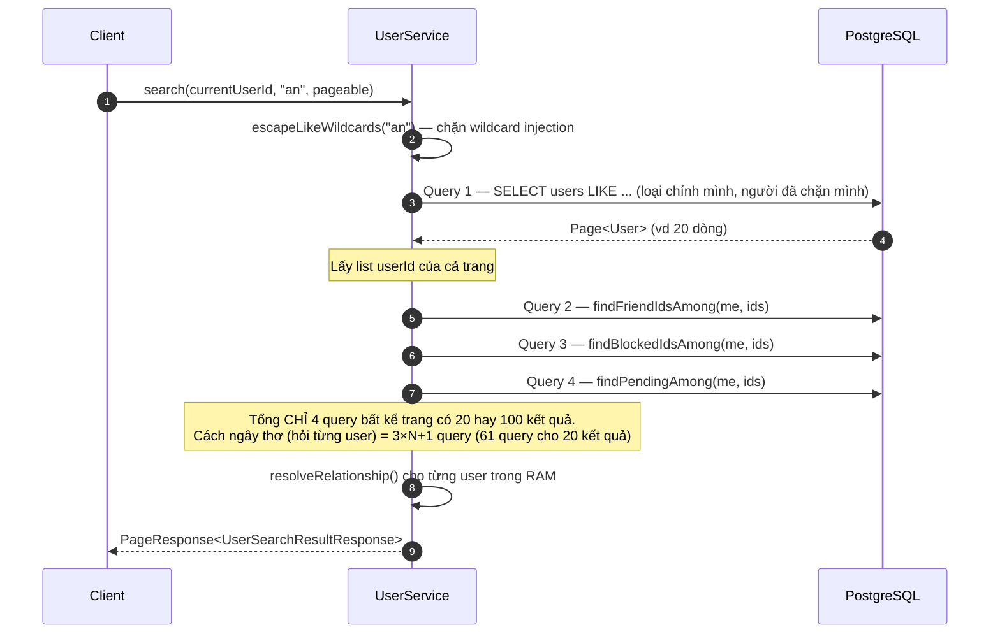
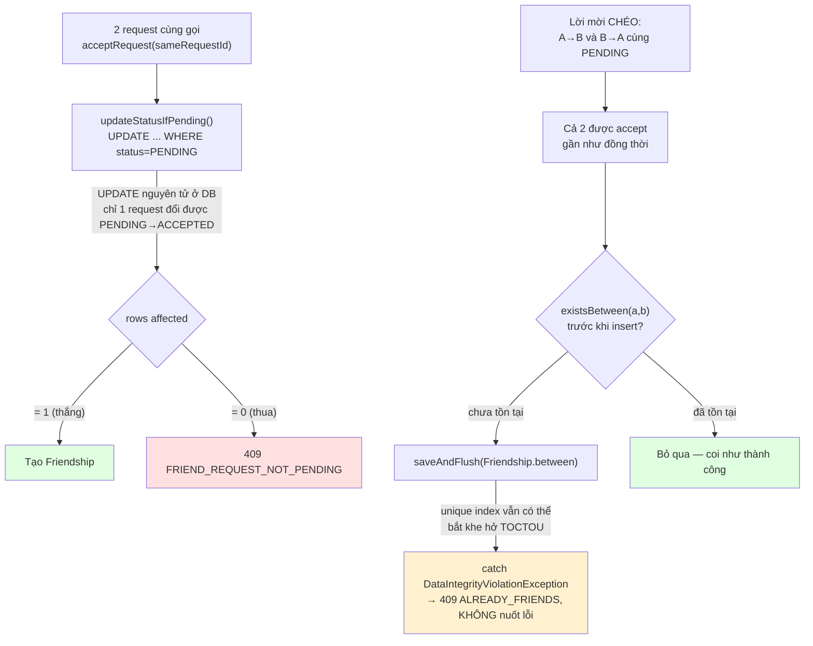
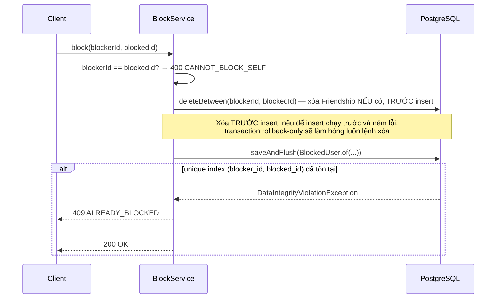

# BÁO CÁO PHASE 2 — USER & FRIEND MODULE

**Dự án**: ChatSphere backend · **Stack**: Spring Boot 4.1.1, Java 21, PostgreSQL 16, Redis 7
**Trạng thái**: hoàn thành, 46/46 test xanh (20 test mới của Phase 2, cộng 26 test Phase 1 không bị vỡ)
**Tài liệu liên quan**: `01_SYSTEM_DESIGN.md` (§7 data model, §8 API), `03_CODE_ROADMAP.md` (§Phase 2),
`06_PHASE1_AUTH_REPORT.md` (nền tảng auth mà Phase này dùng lại), `09_API_REFERENCE_USER_FRIEND.md`

---

## MỤC LỤC

1. [Phạm vi đã làm](#1-phạm-vi-đã-làm)
2. [Bản đồ file](#2-bản-đồ-file)
3. [Mô hình dữ liệu](#3-mô-hình-dữ-liệu)
4. [Bảng endpoint](#4-bảng-endpoint)
5. [Luồng nghiệp vụ chi tiết](#5-luồng-nghiệp-vụ-chi-tiết)
6. [Lý thuyết nền](#6-lý-thuyết-nền)
7. [Bản đồ mã lỗi](#7-bản-đồ-mã-lỗi)
8. [Bảo mật & riêng tư](#8-bảo-mật--riêng-tư)
9. [Test](#9-test)
10. [Lỗi đã phát hiện và sửa](#10-lỗi-đã-phát-hiện-và-sửa)
11. [Nợ kỹ thuật](#11-nợ-kỹ-thuật)
12. [Chạy thử bằng tay](#12-chạy-thử-bằng-tay)

---

## 1. PHẠM VI ĐÃ LÀM

6 use case UC-08 → UC-13:

| UC | Tên | Endpoint chính | Trạng thái |
|---|---|---|---|
| UC-08 | Xem/chỉnh sửa hồ sơ | `GET/PUT /api/v1/users/me` | ✅ |
| UC-09 | Upload avatar | `POST /api/v1/users/me/avatar` | ⏸ Hoãn sang Phase 5 (cần `MediaService`/MinIO) |
| UC-10 | Tìm kiếm người dùng | `GET /api/v1/users/search?q=` | ✅ |
| UC-11 | Kết bạn (gửi/nhận/chấp nhận/hủy) | `POST/PUT/DELETE /api/v1/friend-requests/*`, `/api/v1/friends` | ✅ |
| UC-12 | Chặn người dùng | `POST/DELETE /api/v1/users/{id}/block` | ✅ |
| UC-13 | Cài đặt quyền riêng tư | `GET/PUT /api/v1/users/me/settings` | ✅ |

**Quy mô**: 31 file Java mới (main) + 2 file test, 4 migration SQL (65 dòng), ~1.925 dòng code
(main + test của module `user`).

**UC-09 hoãn có chủ ý**: viết tạm một service upload nội bộ rồi refactor sau sẽ phải viết 2 lần, và
bản tạm gần như chắc chắn thiếu kiểm tra magic-byte (chặn file `.exe` đội lốt `.jpg`) mà Phase 5 làm
đúng chuẩn ngay từ đầu bằng Apache Tika.

---

## 2. BẢN ĐỒ FILE

```
com.chatsphere.user
│
├── controller/
│   ├── UserController.java          8 endpoint: profile, search, settings, block/unblock
│   └── FriendController.java        8 endpoint: friend-requests CRUD-like, friends list
│
├── domain/
│   ├── User / UserRole / UserStatus.java        (Phase 1, dùng lại)
│   ├── UserSettings.java             shared PK (@MapsId với User) — quan hệ 1-1
│   ├── PrivacyLevel.java             enum dùng chung cho online_visibility + call_permission
│   ├── FriendRequest.java            extends BaseEntity — có updated_at (đổi trạng thái nhiều lần)
│   ├── FriendRequestStatus.java      PENDING / ACCEPTED / REJECTED / CANCELLED
│   ├── Friendship.java               KHÔNG extends BaseEntity — bất biến, chỉ có created_at
│   │                                 factory between() tự sắp user1 < user2 (thứ tự Postgres)
│   └── BlockedUser.java              có hướng (blocker → blocked), KHÔNG chuẩn hóa như Friendship
│
├── dto/                              Toàn bộ record — tách UserProfileResponse (đầy đủ, chính chủ)
│   │                                 khỏi UserSummaryResponse (rút gọn, không email — cho người khác)
│   ├── UserProfileResponse / UpdateProfileRequest.java
│   ├── UserSummaryResponse.java
│   ├── RelationshipStatus.java       SELF/FRIEND/REQUEST_SENT/REQUEST_RECEIVED/BLOCKED/NONE
│   ├── UserSearchResultResponse.java  UserSummaryResponse + RelationshipStatus
│   ├── SendFriendRequestRequest / FriendRequestResponse / FriendResponse.java
│   └── UserSettingsResponse / UpdateSettingsRequest.java
│
├── mapper/
│   └── UserMapper.java               MapStruct, unmappedTargetPolicy = ERROR, STATELESS
│                                     (không đọc SecurityContext — tái dùng được ở WebSocket Phase 4)
│
├── repository/
│   ├── UserRepository.java           + search() LIKE có ESCAPE, loại người đã chặn mình
│   ├── FriendshipRepository.java     JOIN FETCH 2 chiều, deleteBetween, findFriendIdsAmong (batch)
│   ├── FriendRequestRepository.java  updateStatusIfPending (compare-and-set), findPendingAmong (batch)
│   ├── BlockedUserRepository.java    existsBlockBetween (1 query, 2 chiều), findBlockedIdsAmong (batch)
│   └── UserSettingsRepository.java   PK = userId, không cần method riêng
│
└── service/
    ├── UserService.java              profile, search() — tính RelationshipStatus cho CẢ TRANG
    │                                 bằng đúng 3 query, tránh N+1 (20 kết quả = 4 query, không phải 61)
    ├── FriendService.java            NƠI TẬP TRUNG RACE CONDITION NHẤT PHASE 2 — xem §5.2
    ├── BlockService.java             isBlockedBetween 2 chiều 1 query — dùng lại ở Phase 3, 6
    └── UserSettingsService.java      lazy-create khi đọc lần đầu (không sửa AuthService.register())

com.chatsphere.common (bổ sung so với Phase 1)
└── PageResponse<T>.java              bọc Page<E> của Spring Data — không serialize PageImpl trực tiếp
```

**Test mới**:

```
src/test/java/com/chatsphere/user/
├── service/FriendServiceIntegrationTest.java   15 test — gọi thẳng service qua Postgres thật
└── FriendControllerIntegrationTest.java         5 test — qua HTTP thật (MockMvc), xác nhận
                                                  SecurityConfig + JSON snake_case nối đúng
```

---

## 3. MÔ HÌNH DỮ LIỆU

### 3.1. Vì sao mỗi entity có "hình dạng audit" khác nhau

Không phải mọi bảng đều kế thừa `BaseEntity` (Phase 0: `id` + `created_at` + `updated_at`) — quyết
định dựa trên **ngữ nghĩa bất biến của dữ liệu**, không phải cho tiện:

| Entity | `id` riêng? | `created_at`? | `updated_at`? | Vì sao |
|---|---|---|---|---|
| `UserSettings` | ❌ (PK = `user_id`) | ❌ | ✅ | Quan hệ 1-1 với User — PK trùng để DB tự đảm bảo tính duy nhất |
| `FriendRequest` | ✅ | ✅ | ✅ | Đổi trạng thái nhiều lần (PENDING→ACCEPTED/REJECTED/CANCELLED) |
| `Friendship` | ✅ | ✅ | ❌ | **Bất biến** sau khi tạo — không có khái niệm "cập nhật" |
| `BlockedUser` | ✅ | ✅ | ❌ | Bất biến tương tự |

### 3.2. ERD (phần thêm bởi Phase 2)

```mermaid
erDiagram
    users ||--o| user_settings : "1-1 (shared PK)"
    users ||--o{ friend_requests : "sender_id"
    users ||--o{ friend_requests : "receiver_id"
    users ||--o{ friendships : "user_id_1"
    users ||--o{ friendships : "user_id_2"
    users ||--o{ blocked_users : "blocker_id"
    users ||--o{ blocked_users : "blocked_id"

    user_settings {
        uuid user_id PK_FK
        varchar online_visibility
        varchar call_permission
        boolean notification_enabled
    }
    friend_requests {
        uuid id PK
        uuid sender_id FK
        uuid receiver_id FK
        varchar status
    }
    friendships {
        uuid id PK
        uuid user_id_1 FK "user_id_1 < user_id_2"
        uuid user_id_2 FK
    }
    blocked_users {
        uuid id PK
        uuid blocker_id FK
        uuid blocked_id FK
    }
```

### 3.3. State machine của `friend_requests.status`



### 3.4. Hai bất biến DB then chốt

**(a) Partial unique index thay vì unique thường** (`friend_requests`):

```sql
CREATE UNIQUE INDEX idx_friend_requests_pending
    ON friend_requests (sender_id, receiver_id)
    WHERE status = 'PENDING';
```

Nếu unique trên cả cặp không kèm điều kiện: A gửi lời mời cho B, B từ chối, 3 tháng sau A muốn gửi
lại → **bị chặn** vì đã tồn tại 1 dòng (A, B). Partial index chỉ áp ràng buộc lên dòng `PENDING`, vừa
chặn spam vừa cho gửi lại sau khi bị từ chối, vừa giữ nguyên lịch sử.

**(b) `CHECK (user_id_1 < user_id_2)` và cạm bẫy so sánh UUID** (`friendships`):

> ⚠️ **`UUID.compareTo()` của Java KHÔNG cùng thứ tự với `uuid <` của PostgreSQL.**
> PostgreSQL so 16 byte **không dấu** (unsigned); Java so `mostSignificantBits` như **`long` có
> dấu**. UUID v4 có bit cao ngẫu nhiên → khoảng **một nửa** số UUID bị hai bên xếp thứ tự ngược nhau.
> Sắp cặp bằng `compareTo()` rồi INSERT sẽ ăn `chk_friendships_order` **ngẫu nhiên** ~25% số lần —
> loại bug mà test chạy 10 lần xanh 8 lần.

`Friendship.between()` sửa đúng bằng `Long.compareUnsigned`:

```java
private static int comparePostgresOrder(UUID a, UUID b) {
    int high = Long.compareUnsigned(a.getMostSignificantBits(), b.getMostSignificantBits());
    return high != 0 ? high : Long.compareUnsigned(a.getLeastSignificantBits(), b.getLeastSignificantBits());
}
```

Đây là factory **duy nhất** được phép tạo `Friendship` — bất biến "không thể nhớ thủ công" được đóng
gói vào một chỗ, thay vì rải rác ở mọi nơi gọi.

---

## 4. BẢNG ENDPOINT

| # | Method | Path | Auth | Body/Query vào | Body ra (`data`) |
|---|---|---|---|---|---|
| 1 | GET | `/api/v1/users/me` | Bearer | — | `UserProfileResponse` (có email) |
| 2 | PUT | `/api/v1/users/me` | Bearer | display_name, bio, date_of_birth | `UserProfileResponse` |
| 3 | GET | `/api/v1/users/{id}` | Bearer | — | `UserSummaryResponse` (không email) |
| 4 | GET | `/api/v1/users/search?q=&page=&size=` | Bearer | `q` (bắt buộc, không rỗng) | `PageResponse<UserSearchResultResponse>` |
| 5 | GET | `/api/v1/users/me/settings` | Bearer | — | `UserSettingsResponse` |
| 6 | PUT | `/api/v1/users/me/settings` | Bearer | online_visibility, call_permission, notification_enabled | `UserSettingsResponse` |
| 7 | POST | `/api/v1/users/{id}/block` | Bearer | — | `null` |
| 8 | DELETE | `/api/v1/users/{id}/block` | Bearer | — | `null` (idempotent) |
| 9 | POST | `/api/v1/friend-requests` | Bearer | receiver_id | `FriendRequestResponse` |
| 10 | PUT | `/api/v1/friend-requests/{id}/accept` | Bearer | — | `FriendRequestResponse` |
| 11 | PUT | `/api/v1/friend-requests/{id}/reject` | Bearer | — | `null` |
| 12 | DELETE | `/api/v1/friend-requests/{id}` | Bearer | — | `null` (cancel, chỉ sender) |
| 13 | GET | `/api/v1/friend-requests/received` | Bearer | — | `PageResponse<FriendRequestResponse>` |
| 14 | GET | `/api/v1/friend-requests/sent` | Bearer | — | `PageResponse<FriendRequestResponse>` |
| 15 | GET | `/api/v1/friends` | Bearer | — | `PageResponse<FriendResponse>` |
| 16 | DELETE | `/api/v1/friends/{id}` | Bearer | — | `null` |

Toàn bộ 16 endpoint đều yêu cầu `Authorization: Bearer <access_token>` — `currentUserId` lấy qua
`@AuthenticationPrincipal UUID`, **không** đọc `SecurityContextHolder` trong service (lý do ở §6.1).

Endpoint #3, #12–14, #8, #16 **không nằm trong bảng tóm tắt** mục 8.2 của `01_SYSTEM_DESIGN.md`
(bảng đó chỉ liệt kê endpoint tiêu biểu) — chúng expose đầy đủ các method đã viết ở tầng service
(`getPublicProfile`, `cancelRequest`, `getReceivedRequests`/`getSentRequests`, `unblock`,
`removeFriend`); không có controller thì các method này không gọi được từ đâu cả.

---

## 5. LUỒNG NGHIỆP VỤ CHI TIẾT

### 5.1. Tìm kiếm kèm quan hệ — tránh N+1 bằng 3 query gộp



**Thứ tự ưu tiên khi 1 user rơi vào nhiều tập hợp cùng lúc** (`resolveRelationship`):
`BLOCKED` → `FRIEND` → `REQUEST_SENT` → `REQUEST_RECEIVED` → `NONE`. `BLOCKED` phải đứng đầu vì nó
không thể đồng thời là bạn (chặn đã hủy friendship — xem §5.3).

### 5.2. Chấp nhận lời mời — nơi tập trung race condition nhất Phase 2

Hai kịch bản cạnh tranh dữ liệu xảy ra đồng thời:



**Vì sao không dùng `synchronized`**: chỉ khóa trong **một JVM** — chạy 2 instance backend (bình
thường khi deploy thật) là vô tác dụng, và lỗi này sẽ không lộ ra cho tới khi lên production nhiều
instance. Ràng buộc DB (`updateStatusIfPending` + unique index) là nguồn chân lý duy nhất mà **mọi**
instance đều tôn trọng, không cần khóa phân tán.

**Vì sao không `catch` rồi im lặng tiếp tục ghi thêm dữ liệu**: sau khi
`DataIntegrityViolationException` xảy ra, transaction đã bị JDBC đánh dấu **rollback-only**. Bắt được
exception không có nghĩa transaction còn dùng được — mọi lệnh ghi tiếp theo trong cùng transaction sẽ
hỏng. Code kiểm tra `existsBetween()` **trước khi** insert để né phần lớn trường hợp, và nếu vẫn dính
khe hở TOCTOU hiếm gặp thì để lỗi nổi lên cho client thử lại, thay vì cố gắng "sửa chữa" một
transaction đã chết. (Bản giải thích ban đầu ở buổi trao đổi có nuốt lỗi này — đã sửa, xem §10.2.)

### 5.3. Chặn người dùng — hủy luôn quan hệ bạn bè



Không chặn thì vẫn để friendship tồn tại, người bị chặn tiếp tục thấy mình trong danh sách bạn của
người kia rồi thử nhắn tin và nhận lỗi liên tục — trải nghiệm tệ hơn nhiều so với hủy bạn ngay khi chặn.

---

## 6. LÝ THUYẾT NỀN

### 6.1. Vì sao service nhận `currentUserId` làm tham số, không tự đọc `SecurityContextHolder`

```java
// ĐÚNG — controller lấy identity, truyền xuống service
public UserProfileResponse getMyProfile(UUID currentUserId) { ... }

// SAI — service tự đọc SecurityContext
public UserProfileResponse getMyProfile() {
    UUID me = ((UserPrincipal) SecurityContextHolder.getContext()
            .getAuthentication().getPrincipal()).getId();
    ...
}
```

`SecurityContextHolder` dùng `ThreadLocal`. Ở **Phase 4**, `ChatWebSocketController` sẽ gọi lại
`FriendService`/`UserService` từ luồng xử lý STOMP — nơi **không có** `SecurityContext` của HTTP
request (thread khác hẳn). Service đọc `SecurityContextHolder` chạy tốt qua REST và ném NPE qua
WebSocket — một lớp lỗi chỉ lộ ra ở Phase 4, rất khó lần ngược lại Phase 2. Cùng lý do, `UserMapper`
được thiết kế **stateless**, không có tác dụng phụ, tái dùng được ở cả hai luồng.

### 6.2. Vì sao tách `UserProfileResponse` / `UserSummaryResponse` thay vì 1 DTO có field nullable

| Phương án | Rò rỉ email khi quên lọc | Chi phí |
|---|---|---|
| 1 DTO, set `email = null` khi không phải chính chủ | **Lỗi runtime**, không test nào bắt được | Thấp lúc viết, cao lúc debug |
| `@JsonView` (1 class, nhiều view) | Vẫn là lỗi runtime nếu quên gắn `@JsonView` | Trung bình |
| **2 record riêng** (đã chọn) | **Lỗi compile** — `UserSummaryResponse` không có field để chứa email | Thêm 1 file |

Nguyên tắc *make illegal states unrepresentable*: đừng dựa vào kỷ luật lập trình viên khi có thể dựa
vào trình biên dịch. `UserMapper` có `unmappedTargetPolicy = ReportingPolicy.ERROR` củng cố thêm lớp
này — quên map field mới thì **build fail** thay vì trả `null` âm thầm lúc chạy.

### 6.3. Compare-and-set UPDATE thay cho khóa bi quan (pessimistic lock)

```sql
UPDATE friend_requests SET status = :new
WHERE id = :id AND status = 'PENDING'
```

Đây là kiểu **optimistic concurrency control** rẻ nhất có thể: một câu `UPDATE` là nguyên tử ở mọi
RDBMS, không cần `SELECT ... FOR UPDATE`, không cần lo thứ tự khóa gây deadlock. Số dòng bị ảnh hưởng
(0 hoặc 1) chính là kết quả của cuộc đua — không cần thêm state nào khác để biết ai thắng.

### 6.4. Vì sao `escapeLikeWildcards` bắt buộc, không phải tối ưu tùy chọn

```java
private String escapeLikeWildcards(String keyword) {
    return keyword.replace("\\", "\\\\")   // escape dấu escape TRƯỚC
                  .replace("%", "\\%")
                  .replace("_", "\\_");
}
```

Nếu bỏ qua bước này, người dùng gõ `%` vào ô tìm kiếm sẽ khớp **toàn bộ bảng `users`** — không phải
lỗi bảo mật nghiêm trọng (JPA vẫn dùng prepared statement, không phải SQL injection cổ điển), nhưng
là kênh để dump danh sách người dùng chỉ bằng một ký tự. Thứ tự escape quan trọng: phải escape `\`
trước, nếu không sẽ escape nhầm chính các ký tự escape vừa thêm vào. Có test riêng khóa hành vi này
(`tim_kiem_voi_ky_tu_dai_dien_khong_dump_toan_bo_bang`).

---

## 7. BẢN ĐỒ MÃ LỖI

| Mã | HTTP | Ném ở đâu |
|---|---|---|
| `CANNOT_FRIEND_SELF` | 400 | `FriendService.sendRequest()` — `senderId == receiverId` |
| `ALREADY_FRIENDS` | 409 | `sendRequest()` nếu đã là bạn; `acceptRequest()` nếu khe hở TOCTOU của lời mời chéo |
| `FRIEND_REQUEST_ALREADY_SENT` | 409 | `sendRequest()` — partial unique index chặn gửi trùng khi đang PENDING |
| `FRIEND_REQUEST_NOT_FOUND` | 404 | request không tồn tại, **hoặc** người gọi không phải actor hợp lệ (không tiết lộ sự tồn tại) |
| `FRIEND_REQUEST_NOT_PENDING` | 409 | accept/reject/cancel một request đã được xử lý (compare-and-set trả 0 dòng) |
| `NOT_FRIENDS` | 404 | `removeFriend()` khi 2 người chưa từng là bạn |
| `USER_BLOCKED` | 403 | có quan hệ chặn ở **bất kỳ chiều nào** giữa 2 người — cùng 1 mã cho cả 2 chiều (§8) |
| `CANNOT_BLOCK_SELF` | 400 | `BlockService.block()` — `blockerId == blockedId` |
| `ALREADY_BLOCKED` | 409 | chặn 2 lần liên tiếp (unique index) |
| `USER_NOT_FOUND` | 404 | (Phase 1, dùng lại) — user không tồn tại hoặc đã xóa mềm |
| `VALIDATION_ERROR` | 400 | `@Valid`/`@Validated` thất bại — bao gồm `q` rỗng khi search |

---

## 8. BẢO MẬT & RIÊNG TƯ

| Nguy cơ | Biện pháp | Ở đâu |
|---|---|---|
| Rò rỉ email qua API công khai | Tách hẳn DTO — không có chỗ chứa email trong `UserSummaryResponse` | §6.2 |
| Biết mình bị ai đó chặn (qua thông báo lỗi) | `USER_BLOCKED` dùng **chung 1 mã** cho cả 2 chiều "tôi chặn nó" / "nó chặn tôi" | `BlockService.assertNotBlocked` |
| Bị tìm thấy bởi người mình đã chặn | `UserRepository.search()` loại người mà **kết quả** đã chặn **mình** (`NOT EXISTS ... blocker=u.id AND blocked=me`) | `UserRepository.search` |
| Dò sự tồn tại của 1 request qua id | Actor sai (không phải sender/receiver hợp lệ) nhận **404** giống hệt "không tồn tại", không phải 403 | `FriendService.changeStatus`, `acceptRequest` |
| Dump toàn bộ danh sách user qua wildcard `%`/`_` | `escapeLikeWildcards()` trước khi build query LIKE | §6.4 |
| Race condition tạo dữ liệu trùng/kẹt | Unique index + partial index + compare-and-set UPDATE, không dựa vào `synchronized` | §5.2, §6.3 |
| Vẫn "là bạn" với người đã chặn mình | `block()` xóa `Friendship` **trong cùng transaction**, trước khi insert `BlockedUser` | §5.3 |

**Lưu ý đọc dữ liệu Redis cache cho `isBlockedBetween`** (roadmap gợi ý ở mục 2.3): cố tình **chưa
làm** ở Phase này — cache sai (quên invalidate đúng lúc) sẽ khiến người đã bỏ chặn vẫn bị chặn thêm
vài phút, một loại bug khó phát hiện hơn nhiều so với chi phí thêm 1 query hiện tại. Chỉ nên thêm khi
có số đo thật cho thấy đây là nút cổ chai (Phase 8.3).

---

## 9. TEST

**46 test, tất cả xanh.** Tổng thời gian chạy suite ~50 giây (phần lớn là khởi động Testcontainers).

### Phân bổ theo file

| File | Số test | Dựng gì | Trả lời câu hỏi |
|---|---|---|---|
| `FriendServiceIntegrationTest` | 15 | Postgres thật (Testcontainers), gọi thẳng service | "Ràng buộc DB + luật nghiệp vụ có đúng không?" |
| `FriendControllerIntegrationTest` | 5 | Spring context đầy đủ + MockMvc | "Controller + SecurityConfig + JSON có ráp đúng với service không?" |

**Không dùng Mockito cho tầng service của Phase 2** (khác Phase 1) — vì toàn bộ giá trị nằm ở các
ràng buộc DB thật (partial unique index, `CHECK`, compare-and-set `UPDATE`) mà Mockito không thể mô
phỏng. Mock repository sẽ khiến test "xanh" ngay cả khi migration SQL sai.

### 15 test tầng service — theo checklist 2.5 của roadmap và các nhánh tự phát hiện

| Nhóm | Test | Kiểm chứng |
|---|---|---|
| Happy path | `gui_loi_moi_roi_chap_nhan_tao_dung_1_friendship` | `user1 < user2` đúng thứ tự **Postgres**, không phải thứ tự gửi lời mời |
| **Checklist 2.5** | `tu_ket_ban_voi_chinh_minh_bi_chan` | `CANNOT_FRIEND_SELF` |
| **Checklist 2.5** | `gui_loi_moi_cho_nguoi_da_chan_minh_bi_tu_choi` | `USER_BLOCKED` |
| **Checklist 2.5** | `chap_nhan_request_khong_ton_tai_bao_404` | `FRIEND_REQUEST_NOT_FOUND` |
| Ràng buộc DB | `gui_loi_moi_trung_lap_bi_chan_boi_partial_unique_index` | Partial unique index hoạt động |
| Nghiệp vụ đặc biệt | `loi_moi_cheo_tu_dong_duoc_chap_nhan` | A→B rồi B→A tự động thành ACCEPTED, không tạo request thứ 2 |
| **Race condition thật** | `chap_nhan_2_lan_dong_thoi_chi_1_lan_thanh_cong` | 2 thread thật cùng accept 1 request → đúng 1 thắng, 1 thua, đúng 1 `Friendship` |
| Nhánh actor sai | `tu_choi_boi_nguoi_khong_phai_nguoi_nhan_bao_404` | `rejectRequest` chỉ receiver được gọi |
| Nhánh actor sai | `thu_hoi_boi_nguoi_khong_phai_nguoi_gui_bao_404` | `cancelRequest` chỉ sender được gọi |
| Block | `chan_nguoi_dang_la_ban_thi_huy_luon_friendship` | Chặn xóa friendship trong cùng transaction |
| Block | `chan_2_lan_lien_tiep_bao_loi_409` | `ALREADY_BLOCKED` |
| Block | `bo_chan_nguoi_chua_tung_chan_khong_bao_loi` | `unblock` idempotent |
| removeFriend | `huy_ket_ban_khi_chua_la_ban_bao_404` | `NOT_FRIENDS` |
| Search | `tim_kiem_tra_ve_dung_relationship_cho_moi_trang_thai` | FRIEND/BLOCKED/NONE tính đúng cho cả trang |
| Search | `tim_kiem_voi_ky_tu_dai_dien_khong_dump_toan_bo_bang` | `escapeLikeWildcards` chặn wildcard injection |

**3 nhánh actor-sai/NOT_FRIENDS không có trong checklist gốc của roadmap** — được thêm sau khi rà lại
code và nhận ra `changeStatus()` (dùng chung cho reject + cancel) và `removeFriend()` có nhánh kiểm
tra quyền chưa từng được test chạm tới.

### 5 test tầng controller — HTTP thật, không gọi thẳng service

`luong_ket_ban_day_du_qua_http` là test dài nhất: đăng ký 2 user thật → xác thực OTP (bắt qua
`ApplicationEvents`, không đụng SMTP) → login → search (xác nhận **không có field `email`** trong kết
quả) → gửi lời mời → accept → xác nhận trong `/friends` của **cả 2 phía** → search lại (relationship
đổi thành `FRIEND`) → chặn (bạn bè biến mất khỏi `/friends`) → người bị chặn gửi lại lời mời nhận
`403 USER_BLOCKED` → bỏ chặn. Cùng một kịch bản với mục "Kiểm tra hoàn thành Phase 2" của roadmap,
chạy tự động thay vì làm tay qua Swagger.

3 test còn lại: 401 khi chưa đăng nhập, đổi settings qua HTTP, tự kết bạn với chính mình trả 400,
tìm kiếm với `q` toàn khoảng trắng trả `VALIDATION_ERROR`.

---

## 10. LỖI ĐÃ PHÁT HIỆN VÀ SỬA

Phát hiện trong lúc code + chạy thật (không phải rà soát tĩnh sau khi xong) — đúng tinh thần
"code xong chạy ngay, thấy lỗi sửa luôn" thay vì tin vào việc đọc lại code.

### 🔴 1. Migration chạy "thành công" nhưng không tạo bảng gì cả

`V3__create_user_settings_table.sql` được tạo **rỗng** trước, Flyway chạy migrate lúc đó ghi nhận
version 3 "SUCCESS" với checksum `0` — trùng hợp vì CRC32 của chuỗi rỗng đúng bằng 0. Sau đó nội dung
SQL thật được dán vào file, nhưng vì Flyway đã đánh dấu version 3 "hoàn tất", nó **không bao giờ chạy
lại**. Hậu quả: entity `UserSettings` biên dịch được, `ddl-auto: validate` vẫn pass lúc khởi động thử
(vì Hibernate chỉ validate schema đang có, không validate migration đã "chạy" đúng nội dung gì) —
nhưng bảng `user_settings` **chưa từng tồn tại** trong database dev.

**Cách phát hiện**: chạy `flyway:migrate` cho V4-V6 thì Flyway báo `Migration checksum mismatch for
migration version 3`. Kiểm `\dt` trong `psql` xác nhận bảng thật sự không có.

**Cách sửa**: xóa dòng lịch sử ma (`DELETE FROM flyway_schema_history WHERE version = '3'`) rồi chạy
lại `flyway:migrate` — lần này áp đúng nội dung V3 hiện tại, cộng V4-V6.

> **Bài học chung**: đừng tạo file migration rỗng trước rồi điền nội dung sau nếu app đã từng chạy
> migrate ở khoảng giữa hai bước đó. Flyway coi migration là bất biến sau khi áp dụng — sửa nội dung
> một migration đã chạy **không** tự động chạy lại, kể cả khi checksum lệch (nó chỉ báo lỗi, không
> tự sửa).

### 🟠 2. `acceptRequest()` nuốt lỗi sau khi transaction đã chết

Bản thiết kế đầu tiên bọc `saveAndFlush(Friendship.between(...))` trong `try/catch
DataIntegrityViolationException` rồi **tiếp tục chạy** (`request.setStatus(ACCEPTED)`) như không có
gì xảy ra. Vấn đề: sau khi JDBC ném lỗi vi phạm constraint, transaction đã bị đánh dấu
**rollback-only** — bắt được exception không có nghĩa transaction còn dùng lại được. Nếu logic sau
`catch` cần ghi thêm dữ liệu (ở đây `request.setStatus` chỉ là dirty-checking trên entity đã
`UPDATE` thành công trước đó nên vô hại, nhưng là may mắn chứ không phải thiết kế đúng).

**Cách sửa**: kiểm tra `existsBetween()` **trước khi** insert để né phần lớn trường hợp trùng lặp; ở
khe hở TOCTOU hiếm gặp còn lại (2 lời mời chéo được accept trong cùng mili-giây), để lỗi **nổi lên**
cho client (`409 ALREADY_FRIENDS`) thay vì cố "chữa cháy" một transaction đã chết. Có test race
condition thật với 2 thread xác nhận đúng 1 `Friendship` được tạo (§9).

### 🟡 3. `SmtpEmailService` (đổi sang MIME/Thymeleaf) không còn bọc được lỗi bất ngờ

Khi đổi từ `SimpleMailMessage` (Phase 1) sang `MimeMessageHelper` để hỗ trợ email HTML, code gọi
thêm `mailSender.createMimeMessage()` — một method **có giá trị trả về** (khác `send()` là `void`).
Trong test, `JavaMailSender` là `@MockitoBean` **chưa stub**: Mockito trả `null` cho method có giá
trị trả về chưa được `when(...)`, gây `NullPointerException` ngay trong `MimeMessageHelper`. `catch`
cũ chỉ bắt `MailException | MessagingException | UnsupportedEncodingException` — không bắt được NPE
— nên exception thoát ra khỏi luồng `@Async`, bị `SimpleAsyncUncaughtExceptionHandler` nuốt và chỉ
log, vi phạm đúng nguyên tắc mà class này tự đặt ra ("mail hỏng không được sập luồng nghiệp vụ").

**Cách sửa**: mở rộng `catch (Exception e)` trong `SmtpEmailService.send()` (đây là ranh giới hợp lệ
để bắt rộng — toàn bộ hàm tồn tại chỉ để không bao giờ ném gì ra ngoài), và stub đúng
`createMimeMessage()` trong test (`AuthFlowIntegrationTest`, `FriendControllerIntegrationTest`) để
nhánh build MIME/Thymeleaf thật sự được test thay vì luôn vỡ NPE trong im lặng.

### Ngoài ra (không phải bug, nhưng đáng ghi lại)

- Một `DELETE ... WHERE username LIKE 'alice%'` dùng để dọn user test trên database dev đã vô tình
  khớp và xóa một user **không do phiên làm việc này tạo ra** (username khác, tồn tại từ trước).
  Không khôi phục được (xóa cứng, không có backup). Bài học: dọn dữ liệu test bằng `id` cụ thể, không
  bằng pattern rộng — đặc biệt trên database dùng chung dù chỉ là môi trường dev.

---

## 11. NỢ KỸ THUẬT

Ghi lại để không quên, không chặn Phase 3:

| # | Việc | Mức độ | Ghi chú |
|---|---|---|---|
| 1 | `UserService.search()` dùng `LIKE '%...%'`, không tận dụng được index | Trung bình | Nâng cấp full-text `tsvector` + GIN index ở Phase 8.1 (roadmap đã ghi rõ) |
| 2 | Chưa cache Redis cho `BlockService.isBlockedBetween` | Thấp | Cố tình hoãn — xem §8. Chỉ làm khi có số đo cho thấy cần |
| 3 | `UserSettings` tạo lazy, không backfill cho user cũ | Thấp (chủ ý) | Đơn giản hơn viết migration backfill; không ảnh hưởng UX vì `getOrCreate()` luôn trả giá trị hợp lệ |
| 4 | Chưa có endpoint `GET /users/{id}/mutual-friends` hay tương tự | Thấp | Không nằm trong UC-08→13, có thể cần khi làm UI danh sách bạn chung |
| 5 | `UpdateProfileRequest` (PUT thay thế toàn bộ) chưa có bản PATCH từng phần | Thấp | Xem cân nhắc `JsonNullable` trong lúc thiết kế — chưa cần thiết ở quy mô hiện tại |
| 6 | UC-09 (upload avatar) chưa làm | Cao (kế hoạch) | Cố ý hoãn tới Phase 5 — cần `MediaService`/MinIO + kiểm tra magic byte |

---

## 12. CHẠY THỬ BẰNG TAY

```bash
# 0. Bật hạ tầng (nếu chưa)
cd infra && docker compose up -d
cd .. && ./mvnw spring-boot:run

# 1. Đăng ký + xác thực + đăng nhập 2 user (xem 09_API_REFERENCE_USER_FRIEND.md để biết chi tiết Auth)
# ... (lặp lại quy trình ở 06_PHASE1_AUTH_REPORT.md §14 cho "alice" và "bob")

# 2. Alice tìm Bob
curl -s http://localhost:8080/api/v1/users/search?q=bob \
  -H "Authorization: Bearer $ALICE_TOKEN" | jq

# 3. Alice gửi lời mời kết bạn
curl -s -X POST http://localhost:8080/api/v1/friend-requests \
  -H "Authorization: Bearer $ALICE_TOKEN" -H "Content-Type: application/json" \
  -d "{\"receiver_id\":\"$BOB_ID\"}" | jq

# 4. Bob xem lời mời đang chờ, rồi chấp nhận
curl -s http://localhost:8080/api/v1/friend-requests/received \
  -H "Authorization: Bearer $BOB_TOKEN" | jq
curl -s -X PUT http://localhost:8080/api/v1/friend-requests/$REQUEST_ID/accept \
  -H "Authorization: Bearer $BOB_TOKEN" | jq

# 5. Cả 2 xem danh sách bạn bè
curl -s http://localhost:8080/api/v1/friends -H "Authorization: Bearer $ALICE_TOKEN" | jq

# 6. Alice chặn Bob, xác nhận Bob biến mất khỏi /friends, rồi Bob thử gửi lại lời mời -> 403
curl -s -X POST http://localhost:8080/api/v1/users/$BOB_ID/block \
  -H "Authorization: Bearer $ALICE_TOKEN"
```

Hoặc dùng Swagger UI: <http://localhost:8080/swagger-ui.html>

### Chạy test

```bash
./mvnw test          # cần Docker Desktop đang chạy (Testcontainers)
```

---

## KẾT LUẬN

Phase 2 hoàn thành 5/6 use case (UC-09 hoãn có chủ ý sang Phase 5), 46 test xanh (20 test mới). Ba lỗi
đáng chú ý được phát hiện đúng lúc code và chạy thật thay vì đọc lại code tĩnh: một migration "thành
công" nhưng không tạo bảng gì (Flyway checksum), một chỗ nuốt lỗi sau khi transaction đã chết, và một
regression từ Phase 1 khi đổi sang email HTML (mock chưa stub method có giá trị trả về). Cả ba đều
thuộc loại **thất bại âm thầm** — không có exception nào bắn ra ở "điểm chạm" đầu tiên, giống bài học
đã rút ra ở Phase 1.

Race condition ở `acceptRequest()` được xác nhận bằng test 2-thread thật, không chỉ bằng suy luận —
đây là cách duy nhất chứng minh một cơ chế chống race condition thực sự hoạt động dưới tải đồng thời,
thay vì chỉ "trông có vẻ đúng" khi đọc code.

**Sẵn sàng cho Phase 3 — Chat Module (REST)** (UC-14 → UC-17), dùng lại `BlockService.assertNotBlocked`
để chặn gửi tin nhắn giữa 2 người đã chặn nhau.
