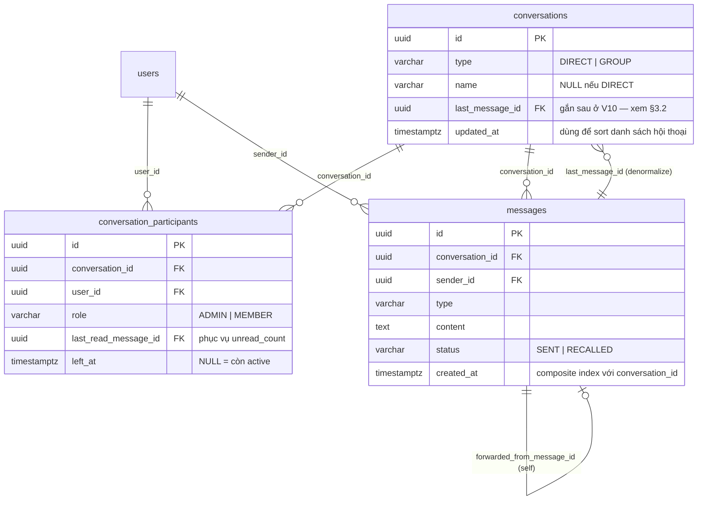
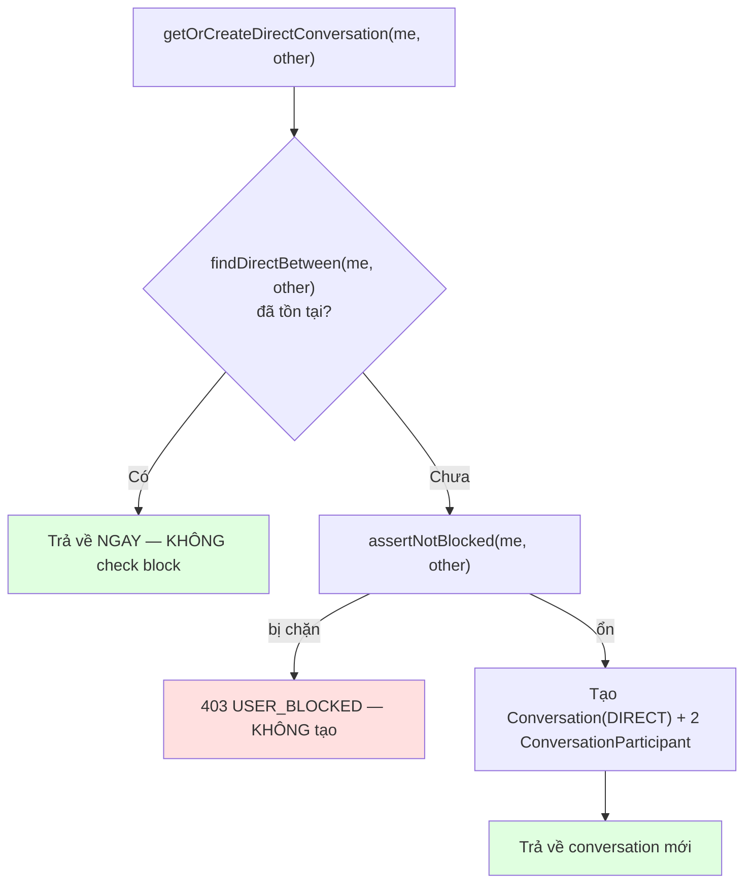
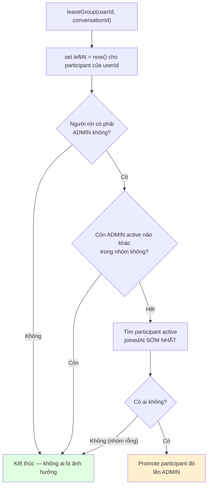
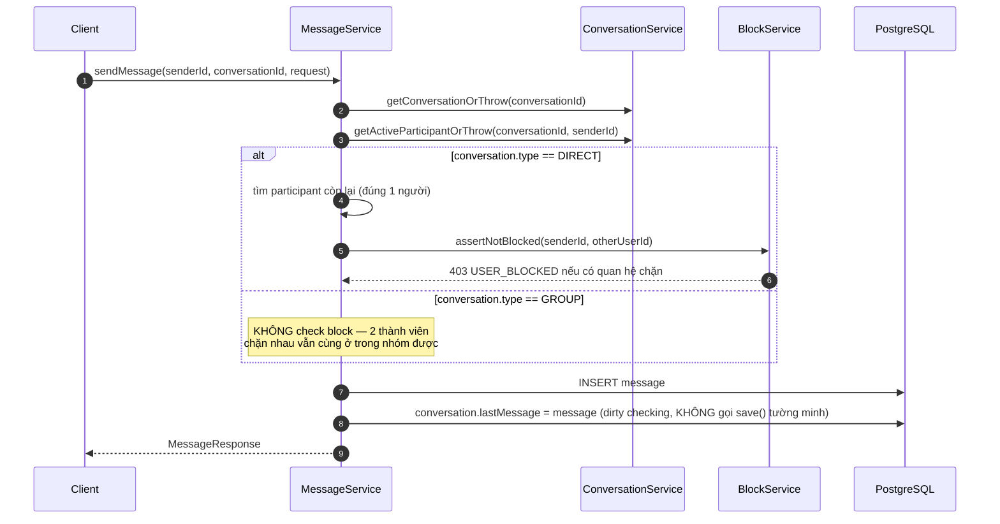
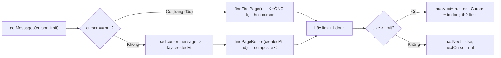

# BÁO CÁO PHASE 3 — CHAT MODULE (REST, CHƯA REAL-TIME)

**Dự án**: ChatSphere backend · **Stack**: Spring Boot 4.1.1, Java 21, PostgreSQL 16, Redis 7
**Trạng thái**: hoàn thành, 70/70 test xanh (24 test mới của Phase 3, cộng 46 test Phase 1-2 không bị vỡ)
**Tài liệu liên quan**: `01_SYSTEM_DESIGN.md` (§7 data model, §8 API), `03_CODE_ROADMAP.md` (§Phase 3),
`08_PHASE2_USER_FRIEND_REPORT.md` (nền tảng `BlockService` mà Phase này dùng lại), `11_API_REFERENCE_CHAT.md`

---

## MỤC LỤC

1. [Phạm vi đã làm](#1-phạm-vi-đã-làm)
2. [Bản đồ file](#2-bản-đồ-file)
3. [Mô hình dữ liệu](#3-mô-hình-dữ-liệu)
4. [Bảng endpoint](#4-bảng-endpoint)
5. [Luồng nghiệp vụ chi tiết](#5-luồng-nghiệp-vụ-chi-tiết)
6. [Lý thuyết nền](#6-lý-thuyết-nền)
7. [Bản đồ mã lỗi](#7-bản-đồ-mã-lỗi)
8. [Bảo mật & riêng tư](#8-bảo-mật--riêng-tư)
9. [Test](#9-test)
10. [Lỗi đã phát hiện và sửa](#10-lỗi-đã-phát-hiện-và-sửa)
11. [Nợ kỹ thuật](#11-nợ-kỹ-thuật)
12. [Chạy thử bằng tay](#12-chạy-thử-bằng-tay)

---

## 1. PHẠM VI ĐÃ LÀM

UC-14 → UC-17 đầy đủ, cộng phần **CRUD qua REST** của UC-18 và UC-20 (real-time hóa các use case
này là việc của Phase 4):

| UC | Tên | Endpoint chính | Trạng thái |
|---|---|---|---|
| UC-14 | Chat 1-1 / danh sách hội thoại | `GET /conversations`, `POST /conversations/direct` | ✅ |
| UC-15 | Tạo nhóm chat | `POST /conversations/group` | ✅ |
| UC-16 | Quản lý nhóm (đổi tên/ảnh, thêm/xóa thành viên) | `PUT /conversations/{id}`, `POST/DELETE .../members` | ✅ |
| UC-17 | Rời nhóm | `POST /conversations/{id}/leave` | ✅ |
| UC-18 | Gửi/nhận tin nhắn — **chỉ REST**, chưa real-time | `POST/GET /conversations/{id}/messages` | ✅ (một phần — WebSocket ở Phase 4) |
| UC-20 | Thu hồi tin nhắn | `PUT /messages/{id}/recall` | ✅ |
| UC-19, UC-21→UC-25 | Media, sửa tin, forward, reaction, search | — | ⏸ Hoãn: UC-19/21-23 cần `MessageAttachment`/`MessageReaction` (Phase 5), UC-25 cần full-text index (Phase 8.1) |

**Quy mô**: 21 file Java mới (main) + 3 file test, 4 migration SQL, entity `Conversation` /
`ConversationParticipant` / `Message` đã có sẵn từ 3.1 (DTO/Mapper từ 3.2).

**Vì sao tách REST khỏi WebSocket** (đúng như `03_CODE_ROADMAP.md` đã đặt vấn đề): toàn bộ business
rule khó nhất của module chat — chống trùng direct conversation, quyền ADMIN, block-check khi gửi
tin, cursor pagination, cửa sổ 5 phút để thu hồi — đều nằm ở tầng Service, **không phụ thuộc** kênh
vận chuyển là HTTP hay STOMP. Viết và test qua REST/Postman trước, sau đó Phase 4 chỉ việc gọi lại
đúng các method này từ `@MessageMapping` rồi `convertAndSend` — không viết lại business logic.

---

## 2. BẢN ĐỒ FILE

```
com.chatsphere.chat
│
├── controller/
│   ├── ConversationController.java   7 endpoint: list, direct, group, update, members, leave
│   └── MessageController.java        3 endpoint: send, list (cursor), recall
│
├── domain/                            (đã có từ 3.1)
│   ├── Conversation.java              extends BaseEntity — lastMessage denormalize
│   ├── ConversationParticipant.java   KHÔNG extends BaseEntity — không có updated_at
│   ├── Message.java                   extends BaseEntity — self-ref replyTo/forwardedFrom
│   └── ConversationType / ParticipantRole / MessageType / MessageStatus.java
│
├── dto/                                (đã có từ 3.2)
│   ├── ConversationResponse / ConversationParticipantResponse.java
│   ├── CreateGroupRequest / UpdateGroupRequest.java
│   ├── CreateDirectConversationRequest / AddMemberRequest.java   (thêm ở 3.4 — controller cần)
│   ├── MessageResponse / SendMessageRequest.java
│
├── mapper/
│   └── ConversationMapper.java         MapStruct, uses = UserMapper.class (tái dùng Phase 2)
│
├── repository/
│   ├── ConversationRepository.java     findDirectBetween, findMyConversations (JOIN FETCH lastMessage)
│   ├── ConversationParticipantRepository.java  findActiveByConversationIds (batch), tie-break ADMIN
│   ├── MessageRepository.java          findFirstPage / findPageBefore (cursor), countUnreadByConversationIds
│   └── ConversationUnreadCount.java    record projection cho query JPQL "SELECT new ..."
│
└── service/
    ├── ConversationService.java        getOrCreateDirect, createGroup, getMyConversations,
    │                                   addMember/removeMember/updateGroupInfo, leaveGroup (§5.2)
    └── MessageService.java             sendMessage, getMessages (cursor), recallMessage

com.chatsphere.common (bổ sung so với Phase 2)
└── CursorPageResponse<T>.java          items + nextCursor + hasNext — KHÔNG có totalElements
                                        (COUNT(*) trên bảng messages là quá đắt, vô nghĩa với UI cuộn vô hạn)
```

**Test mới**:

```
src/test/java/com/chatsphere/chat/
├── service/ConversationServiceIntegrationTest.java   12 test — Postgres thật, business rule nhóm/direct
├── service/MessageServiceIntegrationTest.java         9 test — gửi tin, block, cursor pagination, thu hồi
└── ChatControllerIntegrationTest.java                 3 test — HTTP thật, đúng kịch bản roadmap §"Kiểm tra hoàn thành Phase 3"
```

---

## 3. MÔ HÌNH DỮ LIỆU

### 3.1. ERD phần Phase 3



### 3.2. Phụ thuộc vòng `conversations` ↔ `messages` — giải quyết bằng ALTER TABLE trễ

`conversations.last_message_id` trỏ tới `messages.id` (denormalize để không phải `SELECT ... ORDER
BY created_at DESC LIMIT 1` mỗi lần load danh sách hội thoại), nhưng `messages.conversation_id` lại
trỏ ngược về `conversations.id`. Không bảng nào tạo được trước nếu đòi FK đầy đủ ngay từ đầu:

```
V7  create_conversations_table   — last_message_id là UUID trơn, CHƯA có FK
V8  create_messages_table        — FK conversation_id -> conversations bình thường
V9  create_conversation_participants_table
V10 ALTER TABLE conversations ADD CONSTRAINT fk_conversations_last_message ...
```

Đây là kỹ thuật chuẩn cho quan hệ vòng giữa 2 bảng — tạo cột trước, gắn ràng buộc sau khi bảng kia đã
tồn tại.

### 3.3. Vì sao `ConversationParticipant` không kế thừa `BaseEntity`

Cùng nguyên tắc đã áp dụng cho `Friendship`/`BlockedUser` ở Phase 2: bảng `conversation_participants`
không có cột `updated_at` — trạng thái hay đổi nhất (`last_read_message_id`, `muted_until`) không cần
audit "sửa lúc nào", chỉ `joined_at` (bất biến, gắn `@CreatedDate`) và `left_at` (soft leave) mang ý
nghĩa nghiệp vụ.

### 3.4. Partial unique index cho phép rời-rồi-vào-lại nhóm

```sql
CREATE UNIQUE INDEX idx_participant_active_unique
    ON conversation_participants (conversation_id, user_id) WHERE left_at IS NULL;
```

Không unique trên cả cặp `(conversation_id, user_id)` không điều kiện — nếu vậy, 1 user rời nhóm rồi
được mời lại sẽ đụng UNIQUE với dòng cũ (dù dòng cũ đã "chết" — `left_at` khác NULL). Partial index chỉ
áp ràng buộc lên dòng **active**, đồng thời dòng cũ vẫn giữ lại làm lịch sử tham gia — đúng dữ liệu UC-17
cần để chọn "người tham gia sớm nhất" khi admin cuối cùng rời nhóm.

### 3.5. Composite index & composite cursor trên `messages`

```sql
CREATE INDEX idx_messages_conversation_created_at ON messages (conversation_id, created_at DESC);
```

Đây là index quan trọng nhất hệ thống (bảng `messages` tăng trưởng nhanh nhất). Cursor pagination
dùng đúng cặp cột này: so `(created_at, id) < (cursor.created_at, cursor.id)` thay vì chỉ so
`created_at` — tránh mất/trùng dòng khi 2 tin nhắn có `created_at` giống hệt nhau (bulk insert, đồng
hồ hệ thống không đủ độ phân giải nano-giây).

---

## 4. BẢNG ENDPOINT

| # | Method | Path | Auth | Body/Query vào | Body ra (`data`) |
|---|---|---|---|---|---|
| 1 | GET | `/api/v1/conversations` | Bearer | `page`, `size` | `PageResponse<ConversationResponse>` |
| 2 | POST | `/api/v1/conversations/direct` | Bearer | `user_id` | `ConversationResponse` |
| 3 | POST | `/api/v1/conversations/group` | Bearer | `name`, `member_ids[]` | `ConversationResponse` |
| 4 | PUT | `/api/v1/conversations/{id}` | Bearer (ADMIN) | `name`, `avatar_url` | `ConversationResponse` |
| 5 | POST | `/api/v1/conversations/{id}/members` | Bearer (ADMIN) | `user_id` | `null` |
| 6 | DELETE | `/api/v1/conversations/{id}/members/{userId}` | Bearer (ADMIN) | — | `null` |
| 7 | POST | `/api/v1/conversations/{id}/leave` | Bearer | — | `null` |
| 8 | POST | `/api/v1/conversations/{id}/messages` | Bearer | `type`, `content`, `reply_to_message_id` | `MessageResponse` |
| 9 | GET | `/api/v1/conversations/{id}/messages` | Bearer | `cursor`, `limit` | `CursorPageResponse<MessageResponse>` |
| 10 | PUT | `/api/v1/messages/{id}/recall` | Bearer | — | `MessageResponse` |

Endpoint #2 (`POST .../direct`), #8 (`POST .../messages`) và các DTO `CreateDirectConversationRequest`/
`AddMemberRequest` **không nằm trong bảng tóm tắt** mục 8.2 của `01_SYSTEM_DESIGN.md` (bảng đó liệt kê
endpoint tiêu biểu, viết trước khi controller thật được thiết kế chi tiết) — cùng tình huống đã ghi ở
báo cáo Phase 2 §4: không có controller thì `MessageService.sendMessage()`/`getOrCreateDirectConversation()`
không gọi được từ đâu cả.

---

## 5. LUỒNG NGHIỆP VỤ CHI TIẾT

### 5.1. `getOrCreateDirectConversation` — dedup trước, block-check chỉ khi tạo mới



**Vì sao nhánh "đã tồn tại" không check block**: 2 người có thể đã chat từ trước rồi mới chặn nhau sau
này — họ vẫn cần xem lại lịch sử cũ. Việc chặn tin nhắn **mới** đã được xử lý riêng ở
`MessageService.sendMessage()` (§5.3), không cần lặp lại ở đây.

### 5.2. `leaveGroup` — tự động chuyển quyền ADMIN



**Khác mức độ cứng hóa của `FriendService.acceptRequest()` (Phase 2)**: không dùng khóa bi quan hay
compare-and-set UPDATE cho việc chuyển quyền — chấp nhận khe hở lý thuyết khi 2 admin cuối cùng của
1 nhóm cùng rời trong tích tắc (cực hiếm ở quy mô group chat học tập). Đánh đổi có chủ ý, ghi rõ trong
Javadoc của `ConversationService.leaveGroup()` để không ai nhầm đây là race-condition đã được xử lý
kỹ như Phase 2.

### 5.3. `sendMessage` — block-check CHỈ áp dụng cho DIRECT



**Vì sao GROUP không check block**: phạm vi ghi rõ ở `03_CODE_ROADMAP.md` 3.3 ("chưa bị block bởi bất
kỳ ai trong conversation — **với DIRECT**"). Một nhóm chat công khai không nên bị 1 cặp thành viên chặn
nhau làm tê liệt toàn bộ cuộc trò chuyện của những người còn lại — khác hẳn ngữ cảnh 1-1.

### 5.4. Cursor pagination — 2 query riêng thay vì 1 query gộp điều kiện `IS NULL`



Lý do tách 2 method thay vì 1 query với `(:cursorCreatedAt IS NULL OR m.createdAt < :cursorCreatedAt
OR ...)` được giải thích chi tiết ở §10.2 (bug thật gặp phải khi test).

---

## 6. LÝ THUYẾT NỀN

### 6.1. Vì sao participants/unreadCount không nằm trong query phân trang chính

`ConversationRepository.findMyConversations()` chỉ `LEFT JOIN FETCH` `lastMessage` (quan hệ to-one —
an toàn dùng chung `Pageable`, đúng nguyên tắc đã ghi ở `FriendshipRepository` Phase 2). `participants`
(1-nhiều) và `unreadCount` (cần JOIN thêm bảng `messages`) được lấy bằng **2 query batch riêng cho cả
trang** sau khi đã có danh sách `conversationId`:

```java
participantRepository.findActiveByConversationIds(conversationIds);      // 1 query
messageRepository.countUnreadByConversationIds(userId, conversationIds); // 1 query
```

Nếu fetch collection `participants` ngay trong query có `Pageable`, Hibernate sẽ cảnh báo và **tự phân
trang trong RAM** — tải toàn bộ conversation về rồi mới cắt trang, phá vỡ hoàn toàn mục đích phân trang
ở tầng DB. Đây là cái bẫy y hệt đã tránh ở `FriendshipRepository.findAllWithUsersByUserId()` (Phase 2),
chỉ khác quan hệ 1-nhiều thay vì to-one.

### 6.2. `ConversationUnreadCount` — JPQL constructor expression thay vì `Object[]`

```java
@Query("""
    SELECT new com.chatsphere.chat.repository.ConversationUnreadCount(p.conversation.id, COUNT(m))
    FROM ConversationParticipant p
    JOIN Message m ON m.conversation = p.conversation
        AND m.deletedAt IS NULL
        AND (p.lastReadMessage IS NULL OR m.createdAt > p.lastReadMessage.createdAt)
    WHERE p.user.id = :userId AND p.conversation.id IN :conversationIds AND p.leftAt IS NULL
    GROUP BY p.conversation.id
    """)
List<ConversationUnreadCount> countUnreadByConversationIds(...);
```

`SELECT new <FQCN>(...)` là cú pháp JPQL chuẩn (không phải tính năng riêng của Spring Data) — build
fail ngay nếu record `ConversationUnreadCount` không có constructor khớp đúng thứ tự/kiểu 2 tham số,
thay vì trả `List<Object[]>` phải ép kiểu thủ công (dễ ConcurrentModificationException-kiểu-runtime
khi ai đó đổi thứ tự cột trong `SELECT`).

### 6.3. Vì sao `recallMessage` xóa `content` thật trong DB, không chỉ đổi `status`

Schema `messages.status` có giá trị `RECALLED`, nhưng nếu chỉ đổi cờ mà giữ nguyên `content`, bất kỳ
đường truy vấn nào khác vô tình bỏ sót việc lọc theo `status` (ví dụ 1 báo cáo thống kê viết vội ở
Phase 8) sẽ vô tình lộ lại nội dung đã bị người dùng chủ động xóa. Xóa `content` ngay tại thời điểm
recall biến "đã thu hồi" thành bất biến ở tầng dữ liệu, không phụ thuộc kỷ luật của mọi query sau này —
cùng triết lý *make illegal states unrepresentable* đã áp dụng cho `UserSummaryResponse` ở Phase 2.

### 6.4. Compare-and-set không cần thiết ở `recallMessage` — vì sao

Khác `FriendService.acceptRequest()` (Phase 2) dùng UPDATE nguyên tử để chống 2 request cùng đổi
trạng thái, `recallMessage` chỉ cần kiểm tra `status != RECALLED` **trước khi** ghi vì: (a) hậu quả của
race condition ở đây chỉ là 409 thay vì 200 cho request thua cuộc — không tạo dữ liệu trùng/sai như
`Friendship`; (b) 2 lần thu hồi cùng 1 tin nhắn gần như không xảy ra trong thực tế (khác double-click
accept, vốn là thao tác người dùng rất hay lặp lại). Không tự tạo race-hardening thừa cho tình huống
không có giá trị thực tế tương xứng.

---

## 7. BẢN ĐỒ MÃ LỖI

| Mã | HTTP | Ném ở đâu |
|---|---|---|
| `CONVERSATION_NOT_FOUND` | 404 | Conversation không tồn tại |
| `NOT_CONVERSATION_MEMBER` | 403 | Không phải participant active (gửi tin, xem lịch sử, rời nhóm...) |
| `ALREADY_CONVERSATION_MEMBER` | 409 | `addMember()` với user đã là participant active |
| `GROUP_ADMIN_REQUIRED` | 403 | Actor không phải ADMIN khi update/add/remove member |
| `NOT_A_GROUP_CONVERSATION` | 400 | Gọi thao tác chỉ dành cho GROUP (update/members/leave) trên conversation DIRECT |
| `MESSAGE_NOT_FOUND` | 404 | Message không tồn tại, đã soft-delete, hoặc cursor trỏ tới message không có thật |
| `MESSAGE_NOT_IN_CONVERSATION` | 400 | `replyToMessageId`/cursor thuộc conversation khác |
| `MESSAGE_RECALL_FORBIDDEN` | 403 | Người gọi `recall` không phải sender |
| `MESSAGE_ALREADY_RECALLED` | 409 | Thu hồi 1 tin nhắn đã `RECALLED` từ trước |
| `MESSAGE_RECALL_WINDOW_EXPIRED` | 409 | Quá 5 phút kể từ `createdAt` |
| `USER_BLOCKED` | 403 | (Phase 2, dùng lại) — chỉ áp dụng khi tạo/gửi tin DIRECT |
| `USER_NOT_FOUND` | 404 | (Phase 1, dùng lại) — user trong `member_ids` không tồn tại |

---

## 8. BẢO MẬT & RIÊNG TƯ

| Nguy cơ | Biện pháp | Ở đâu |
|---|---|---|
| Gửi tin vào conversation không thuộc về mình | `getActiveParticipantOrThrow()` ở ĐẦU mọi thao tác đọc/ghi | `ConversationService`, gọi từ cả 2 service |
| Đọc lịch sử tin nhắn của người khác qua đoán UUID conversation | Cùng cơ chế trên — `getMessages()` bắt buộc participant active | `MessageService.getMessages` |
| Thao tác quản trị nhóm bởi thành viên thường | `requireAdmin()` kiểm tra `role == ADMIN` sau khi đã xác nhận participant | `ConversationService` |
| Reply tới message của conversation khác (dò thông tin chéo) | Kiểm `replyTo.getConversation().getId().equals(conversationId)` | `MessageService.sendMessage` |
| Nội dung tin nhắn đã thu hồi vẫn truy vấn được | Xóa `content` thật trong DB, không chỉ đổi cờ `status` (§6.3) | `MessageService.recallMessage` |
| Thu hồi tin nhắn của người khác | Kiểm `message.sender.id == currentUserId` trước khi cho phép | `MessageService.recallMessage` |
| Rò rỉ danh tính qua block khi nhắn tin | Dùng lại `BlockService.assertNotBlocked` (1 mã lỗi cho cả 2 chiều — Phase 2) | `MessageService.sendMessage` |

---

## 9. TEST

**70 test, tất cả xanh** (24 test mới Phase 3). Thời gian chạy suite ~70-90 giây (Testcontainers khởi
động 1 lần dùng chung).

### Phân bổ theo file

| File | Số test | Dựng gì | Trả lời câu hỏi |
|---|---|---|---|
| `ConversationServiceIntegrationTest` | 12 | Postgres thật, gọi thẳng service | "Business rule nhóm/direct + ràng buộc DB có đúng không?" |
| `MessageServiceIntegrationTest` | 9 | Postgres thật, gọi thẳng service | "sendMessage/getMessages/recall có đúng theo từng nhánh không?" |
| `ChatControllerIntegrationTest` | 3 | Spring context đầy đủ + MockMvc | "Controller + SecurityConfig + JSON có ráp đúng, đúng kịch bản roadmap không?" |

### Điểm test đáng chú ý

- `phan_trang_lich_su_tin_nhan_theo_cursor_lay_du_va_dung_thu_tu`: gửi 5 tin nhắn, lấy từng trang
  2-phần-tử bằng vòng lặp thật (không giả lập), ghép lại và so với thứ tự gửi đảo ngược — xác nhận
  cursor không làm mất/trùng/đảo thứ tự dòng nào.
- `admin_duy_nhat_roi_nhom_tu_dong_chuyen_quyen_cho_thanh_vien_con_lai`: nhóm chỉ 2 người (creator +
  1 member) để phép thử **xác định — không phụ thuộc thứ tự `joinedAt` giữa nhiều candidate**, tránh
  test giả (flaky) do 2 lần `save()` liên tiếp trong cùng transaction có thể nhận cùng 1 giá trị
  `Instant.now()` (xem §10.3).
- `thu_hoi_tin_nhan_qua_5_phut_bi_tu_choi`: backdate `created_at` bằng `JdbcTemplate` UPDATE thẳng
  xuống DB — không dùng `ReflectionTestUtils` set field Java, vì `created_at` có `updatable = false`
  ở tầng JPA (`BaseEntity`), Hibernate loại cột này khỏi câu UPDATE dù field Java có bị sửa hay không.
- `luong_day_du_tao_nhom_gui_tin_phan_trang_thu_hoi_roi_nhom`: đúng kịch bản "Kiểm tra hoàn thành
  Phase 3" của roadmap — tạo group 3 người → gửi tin (3 người) → phân trang `limit=2` → thu hồi (sai
  quyền bị 403, đúng quyền thành công, `content` biến mất khỏi JSON) → rời nhóm → xác nhận danh sách
  hội thoại cập nhật đúng cho người đã rời và người còn lại.

---

## 10. LỖI ĐÃ PHÁT HIỆN VÀ SỬA

### 🔴 1. PostgreSQL không suy được kiểu tham số khi 1 param CHỈ xuất hiện trong `? IS NULL`

Thiết kế ban đầu gộp 1 query `findPageBefore` xử lý cả 2 trường hợp (có/không có cursor) bằng:

```sql
WHERE ... AND (:cursorCreatedAt IS NULL
               OR m.createdAt < :cursorCreatedAt
               OR (m.createdAt = :cursorCreatedAt AND m.id < :cursorId))
```

Chạy test lấy trang **đầu tiên** (cursor = null) bắn lỗi JDBC thật:

```
ERROR: could not determine data type of parameter $2
```

**Nguyên nhân**: Hibernate biên dịch mỗi lần xuất hiện của `:cursorCreatedAt` trong JPQL thành 1
positional parameter JDBC riêng ($2, $3, $4...). Tham số $2 (vị trí trong vế `? IS NULL`) không có
ngữ cảnh kiểu dữ liệu nào để PostgreSQL suy luận — `IS NULL` là toán tử polymorphic, không ràng buộc
kiểu — trong khi $3/$4 (so sánh với cột `timestamptz`) suy luận được bình thường. Đây là giới hạn của
trình phân tích kiểu tham số phía PostgreSQL/JDBC driver, không phải lỗi cú pháp JPQL.

**Cách sửa**: tách thành 2 method riêng — `findFirstPage()` (không tham số cursor) và
`findPageBefore()` (cursor luôn khác null) — Service tự chọn gọi method nào dựa trên
`cursor == null`. Loại bỏ hoàn toàn ngữ cảnh `? IS NULL` mơ hồ, đồng thời code đọc rõ ràng hơn (không
còn nhánh "vừa lọc vừa không lọc" gộp trong 1 câu SQL).

### 🟠 2. Test dùng tiếng Việt trong JSON request body bị vỡ dấu qua MockMvc

`ChatControllerIntegrationTest` ban đầu viết nội dung tin nhắn test bằng tiếng Việt có dấu
(`"Xin chào cả nhóm"`). Response trả về body dạng `"Ch�o m?i ng??i"` — dữ liệu bị hỏng thật trong
vòng round-trip HTTP của test, không phải lỗi hiển thị.

**Nguyên nhân**: `MockMvc`'s `.content(String)` encode chuỗi Java thành byte bằng **charset mặc định
của JVM** khi không gọi thêm `.characterEncoding(...)`, không mặc định UTF-8. Trên máy chạy test này,
charset mặc định không phải UTF-8, nên chuỗi tiếng Việt bị mã hóa sai trước khi gửi, còn server đọc
`application/json` theo đúng chuẩn UTF-8 → giải mã ra ký tự thay thế (`U+FFFD`). Đây là hành vi riêng
của công cụ test MockMvc, **không phải lỗi ứng dụng thật** — 1 client HTTP thật (`fetch`, `curl`,
frontend) gửi JSON UTF-8 theo đúng chuẩn HTTP vẫn hoạt động đúng.

**Cách sửa**: đổi nội dung test message sang ASCII (tiếng Anh), đúng quy ước đã có sẵn trong
`FriendControllerIntegrationTest` (Phase 2) — toàn bộ chuỗi dữ liệu JSON test của module đó vốn dĩ đã
luôn là ASCII, chỉ có comment mới dùng tiếng Việt. Không cần sửa code ứng dụng.

### 🟡 3. Assertion `repository.count()` dính state của test class khác chạy trước

`ConversationServiceIntegrationTest` ban đầu assert `conversationRepository.count() == 1` sau khi gọi
`getOrCreateDirectConversation()` 2 lần cho cùng 1 cặp user — kỳ vọng chỉ có đúng 1 dòng được tạo.
Test fail: `expected: 1L but was: 2L`.

**Nguyên nhân**: các integration test trong dự án này **không rollback giữa các test** (không có
`@Transactional` ở `AbstractIntegrationTest`) và **toàn bộ test class trong 1 lần chạy Maven dùng
chung 1 Postgres container** (Testcontainers singleton). `ChatControllerIntegrationTest` chạy trước
đã tạo sẵn conversation khác trong cùng bảng — `count()` đếm **toàn bảng**, không riêng cho cặp user
đang test.

**Cách sửa**: bỏ `count()` toàn bảng, thay bằng assertion scoped đúng đối tượng đang test —
`findDirectBetween(alice, bob)` (đúng 1 kết quả cho cặp này) và
`findActiveByConversationIds(List.of(id))` có đúng 2 participant. Cùng nguyên tắc
`FriendServiceIntegrationTest` (Phase 2) đã áp dụng nhất quán: mọi assertion phải scoped theo id cụ
thể, không dựa vào giả định "database trống" hay "đây là test đầu tiên chạy".

### Ngoài ra (không phải bug logic, nhưng đáng ghi lại)

Trước khi chạy test lần đầu, phát hiện 6 file **stub rỗng** còn sót từ Phase 0 (`com.chatsphere.chat`,
sai package — thiếu `.domain`, và `MessageStatus` stub cũ còn dùng sai giá trị `RECALL` thay vì
`RECALLED` khớp migration). Xóa trước khi build để tránh 2 định nghĩa `Conversation`/`Message` cùng
tồn tại gây nhầm lẫn khi tra cứu — dù về mặt kỹ thuật chúng ở 2 package khác nhau nên không có lỗi
compile.

---

## 11. NỢ KỸ THUẬT

| # | Việc | Mức độ | Ghi chú |
|---|---|---|---|
| 1 | UC-19/21/22/23 (media, sửa tin, forward, reaction) chưa làm | Cao (kế hoạch) | Cần `MessageAttachment`/`MessageReaction` — đúng lịch Phase 5 |
| 2 | UC-25 (tìm kiếm tin nhắn) chưa làm | Trung bình (kế hoạch) | Cần `tsvector` + GIN index — đúng lịch Phase 8.1 |
| 3 | `removeMember()` không tự chuyển ADMIN nếu chính admin tự xóa mình qua endpoint này | Thấp | Trường hợp hiếm (admin nên dùng `leaveGroup` để kích hoạt logic chuyển quyền ở §5.2); chưa chặn cứng bằng validation |
| 4 | Chưa cache `getMyConversations`/`unreadCount` | Thấp | Cố tình hoãn — cùng lý do đã ghi ở nợ kỹ thuật Phase 2 mục `isBlockedBetween`, chỉ làm khi có số đo |
| 5 | `SendMessageRequest.content` bắt buộc `@NotBlank` — sẽ phải nới lỏng khi Phase 5 thêm type=IMAGE/FILE/VOICE (content có thể null, chỉ có attachment) | Thấp (kế hoạch) | Đã ghi rõ trong Javadoc của DTO |
| 6 | Chưa có index full-text hay cache Redis cho `getMyConversations` khi user có hàng nghìn hội thoại | Thấp | Chưa có số đo cho thấy cần; batch-query đã tránh N+1 (§6.1) |

---

## 12. CHẠY THỬ BẰNG TAY

```bash
# 0. Bật hạ tầng (nếu chưa)
cd infra && docker compose up -d
cd .. && ./mvnw spring-boot:run

# 1. Đăng ký + xác thực + đăng nhập 2 user (xem 07_API_REFERENCE_AUTH.md)
# ... lặp lại quy trình ở 06_PHASE1_AUTH_REPORT.md §14 cho "alice" và "bob"

# 2. Alice tạo (hoặc lấy lại) hội thoại 1-1 với Bob
curl -s -X POST http://localhost:8080/api/v1/conversations/direct \
  -H "Authorization: Bearer $ALICE_TOKEN" -H "Content-Type: application/json" \
  -d "{\"user_id\":\"$BOB_ID\"}" | jq
CONV_ID=$(... .data.id ...)

# 3. Alice gửi tin nhắn
curl -s -X POST http://localhost:8080/api/v1/conversations/$CONV_ID/messages \
  -H "Authorization: Bearer $ALICE_TOKEN" -H "Content-Type: application/json" \
  -d '{"type":"TEXT","content":"Hello Bob!"}' | jq

# 4. Bob lấy lịch sử tin nhắn (cursor pagination)
curl -s "http://localhost:8080/api/v1/conversations/$CONV_ID/messages?limit=20" \
  -H "Authorization: Bearer $BOB_TOKEN" | jq

# 5. Alice thu hồi tin nhắn vừa gửi (trong vòng 5 phút)
curl -s -X PUT http://localhost:8080/api/v1/messages/$MESSAGE_ID/recall \
  -H "Authorization: Bearer $ALICE_TOKEN" | jq

# 6. Alice tạo nhóm 3 người, đổi tên nhóm, rồi rời nhóm
curl -s -X POST http://localhost:8080/api/v1/conversations/group \
  -H "Authorization: Bearer $ALICE_TOKEN" -H "Content-Type: application/json" \
  -d "{\"name\":\"Study Group\",\"member_ids\":[\"$BOB_ID\",\"$CAROL_ID\"]}" | jq
```

Hoặc dùng **Postman** — collection "ChatSphere Backend" (Team Workspace), 10 request mới tiền tố
`Chat -` ở gốc collection, mỗi request tự lưu `conversation_id`/`group_conversation_id`/`message_id`
vào collection variable qua test script (chạy `Chat - Create Or Get Direct Conversation` rồi
`Chat - Send Message` là đủ để có dữ liệu cho `Chat - Get Messages`/`Chat - Recall Message`). Chi
tiết từng field, mã lỗi, ví dụ response ở `11_API_REFERENCE_CHAT.md`.

### Chạy test

```bash
./mvnw test          # cần Docker Desktop đang chạy (Testcontainers)
```

---

## KẾT LUẬN

Phase 3 hoàn thành 6/6 use case trong phạm vi REST (UC-19/21-23/25 hoãn có chủ ý sang Phase 5/8), 70
test xanh (24 test mới). Ba vấn đề đáng chú ý phát hiện khi chạy thật: một giới hạn thật của
PostgreSQL trong việc suy luận kiểu tham số JDBC khi tham số chỉ xuất hiện trong `IS NULL` (sửa bằng
tách query, không phải workaround), một cạm bẫy encoding của chính công cụ test (MockMvc dùng charset
JVM mặc định thay vì UTF-8), và một assertion sai do giả định nhầm database test là "trống" trong khi
mọi test class trong 1 lần chạy Maven dùng chung 1 Postgres container.

Toàn bộ business logic (dedup direct conversation, quyền ADMIN, block-check chỉ áp dụng DIRECT, cửa sổ
5 phút thu hồi, tự chuyển ADMIN khi rời nhóm) đều đã viết và test xong ở tầng Service **độc lập với
kênh vận chuyển** — đúng mục tiêu đặt ra ở đầu Phase 3. API cũng đã lên Postman (Team Workspace) để
sẵn sàng demo/tích hợp frontend.

**Sẵn sàng cho Phase 4 — Real-time Chat (WebSocket/STOMP)**: `ChatWebSocketController` sẽ gọi lại
nguyên vẹn `MessageService.sendMessage()` rồi `simpMessagingTemplate.convertAndSend()`, không viết lại
business logic đã có ở Phase này.
